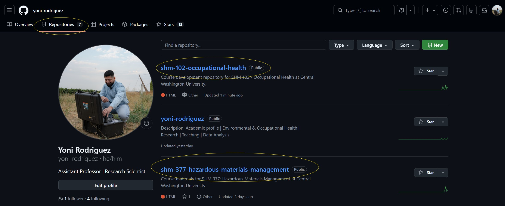
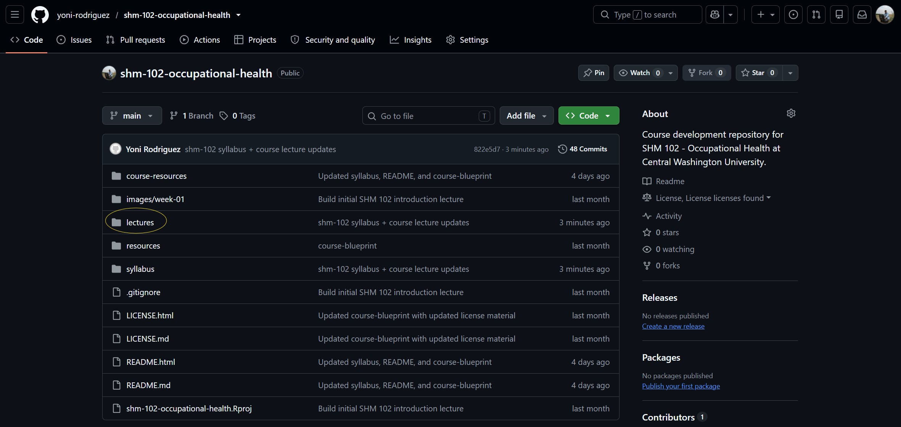
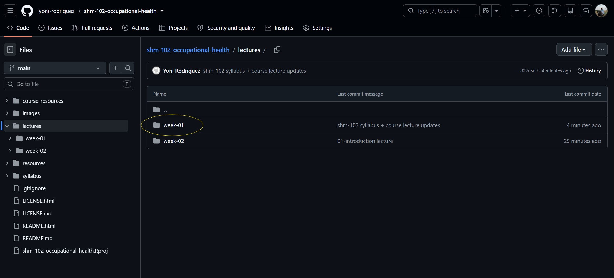
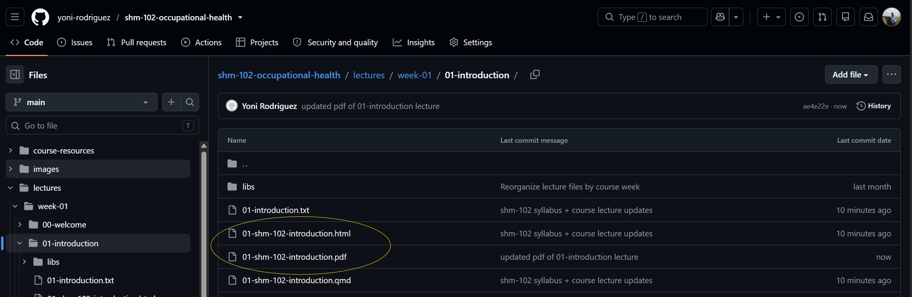
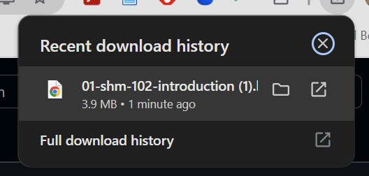
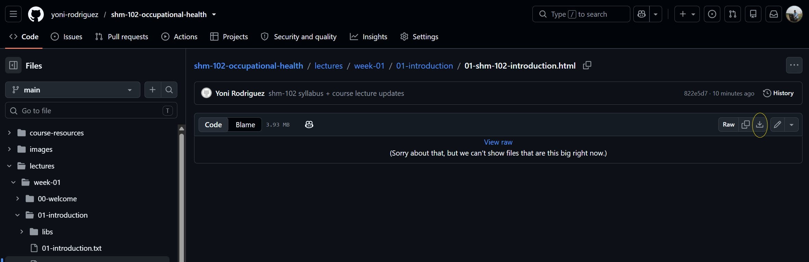

---
title: "How to Access SHM 102 Lectures on GitHub"
subtitle: "SHM 102: Occupational Health"
author: "Yoni Rodriguez"
format:
  html:
    embed-resources: true
    toc: true
    toc-title: "Guide Contents"
    smooth-scroll: true
    link-external-newwindow: true
  pdf:
    toc: true
    number-sections: false
    geometry:
      - top=0.75in
      - bottom=0.75in
      - left=0.75in
      - right=0.75in
    fig-pos: "H"
---

## Why this guide exists

A student reached out with a question about how to access our SHM 102 lecture materials on GitHub. I realized that if one person had this question, others may have the same question.

GitHub contains several different file types, including the source files I use to build our course materials. **You do not need to know how to use GitHub or understand any of the code to access the lectures.**

This guide will walk you through how to find, download, and open the SHM 102 lecture materials.

---

## Step 1: Go to my GitHub profile

Go to my GitHub profile and select **Repositories**.

{fig-alt="GitHub profile showing the Repositories tab and the SHM 102 Occupational Health repository." width=95%}

You will see repositories for both of my courses.

For this course, select:

**shm-102-occupational-health**

---

## Step 2: Open the SHM 102 repository

Once you open **shm-102-occupational-health**, you will see the files and folders used to organize the course materials.

Select the **lectures** folder.

{fig-alt="SHM 102 GitHub repository with the lectures folder highlighted." width=95%}

---

## Step 3: Select the appropriate week

The lectures are organized by week.

For example, select **week-01** to access our Week 1 materials.

{fig-alt="SHM 102 lectures directory showing the week-01 and week-02 folders." width=95%}

As the quarter progresses, additional lecture materials will be organized by their corresponding course week.

---

## Step 4: Select the lecture

Within each week, individual lectures are organized into their own folders.

For example, our introduction lecture is located in:

**lectures → week-01 → 01-introduction**

Inside the lecture folder, you will see several files.

{fig-alt="Week 1 introduction lecture folder showing HTML, PDF, QMD, and supporting files." width=95%}

For students, the two files you should pay attention to are:

**`.html`**  
The interactive version of the lecture that we use in class.

**`.pdf`**  
A PDF version of the lecture that may be easier to download, save, print, or review.

You can ignore the **`.qmd`**, **`.txt`**, **`libs`**, and other development files. These are used to create and maintain the course materials.

---

## Step 5: Download the lecture

Select the **HTML** or **PDF** file that you want to use.

For example:

**01-shm-102-introduction.html**

When you select the HTML file, GitHub may tell you:

> Sorry about that, but we can't show files that are this big right now.

That is okay. The lecture is still available.

Look toward the upper right side of the file and select the **download icon**.

{fig-alt="GitHub HTML lecture file with the download button highlighted." width=95%}

The lecture will download through your web browser.

{fig-alt="Browser download history showing the downloaded SHM 102 introduction HTML lecture." width=75%}

---

## Step 6: Open the downloaded lecture

Once the file has downloaded, open it from your browser's downloads or from your computer's **Downloads** folder.

For the **HTML version**, the lecture should open in your web browser and display as the interactive lecture rather than as code.

For the **PDF version**, the lecture can be opened with your browser or PDF reader and can be saved or printed.

---

## Important

You **do not need to understand or interact with the source code** in the repository.

GitHub is where I maintain the course materials, so you will see both the student-facing lectures and the files used to create them.

For reviewing course content, look for the **`.html` or `.pdf` files** within each lecture folder.

I will continue adding lectures to the repository as we progress through the quarter. If you have trouble accessing a lecture after following these steps, please let me know.

**Yoni Rodriguez**  
Assistant Professor  
Central Washington University