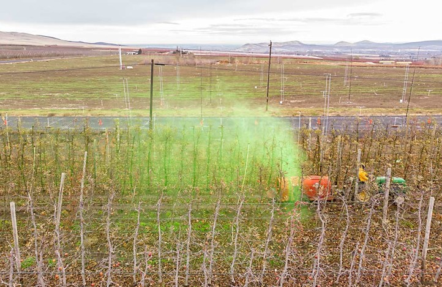
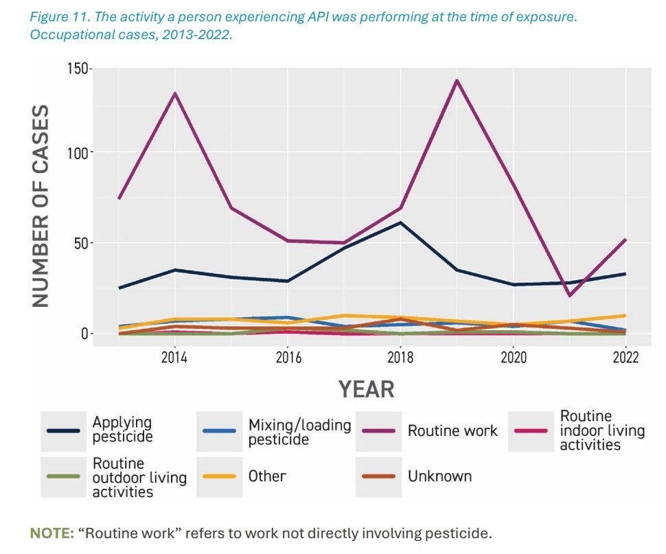

---
format:
  html:
    toc: true
    toc-location: right
    smooth-scroll: true
    code-fold: true
editor: visual
---

:::::: columns
::: {.column width="40%"}
{fig-alt="Mount Rainier photographed by Yoni Rodriguez in 2022"}
:::

::: {.column width="4%"}
:::

::: {.column width="56%"}
## SHM 102: Occupational Health

### Occupational Safety and Health Management

Yoni Rodriguez\
Engineering Technologies, Safety, and Construction\
Central Washington University
:::
::::::

# Introduction

- Who am I?
- What is occupational health?
- Where does occupational health fit?
- What will we do in this course?

# Who am I?

:::::: columns
::: {.column width="44%"}
.](nasa-award.jpg){fig-alt="Yoni Rodriguez receiving the 2024 Peer Award at NASA Armstrong Flight Research Center"}
:::

::: {.column width="5%"}
:::

::: {.column width="51%"}
## Before CWU

**Occupational Health Scientist**\
NASA

## Education

**B.S. Biochemistry**\
Washington State University

**Graduate Training**\
University of Washington

## Today

**Assistant Professor**\
Central Washington University

**Research Scientist**\
University of Washington
:::
::::::

# What is Occupational Health?

::: {style="text-align:center; margin: 4rem 0;"}
## What is Occupational Health?

### A working definition

**"*Occupational and environmental health is the study and prevention of health problems caused or influenced by the environments where people work, live, and interact.*" - Centers for Disease Control and Prevention (CDC)**
:::

:::: {style="text-align:center; margin: 4rem 0;"}
## Where does Occupational Health occur?

::: {style="display:inline-block; text-align:left;"}
- **Do you get exposed on your way to work?**
- **Does the community nearby get exposed?**
- **Do you take the exposures home?**
:::
::::

:::: {style="text-align:center; margin: 4rem 0;"}
## Why is Occupational Health important?

::: {style="display:inline-block; text-align:left;"}
- **Does this impact my health?**
- **Does this impact the health of my family?**
- **Does this impact the health of my community?**
:::
::::

# Current News

[{fig-alt="New York Times article titled This Pesticide May Be Too Dangerous to Use. Farmers Say They Need It." width="90%"}](https://www.nytimes.com/2026/08/13/science/paraquat-pesticide-parkinsons-california.html)

*The New York Times*, August 13, 2026.\
[Read the article →](https://www.nytimes.com/2026/08/13/science/paraquat-pesticide-parkinsons-california.html)

# Where is paraquat used?

<iframe src="https://water.usgs.gov/nawqa/pnsp/usage/maps/show_map.php?year=2018&amp;map=PARAQUAT&amp;hilo=L&amp;disp=Paraquat" width="100%" height="650" style="border:1px solid #ccc;" loading="lazy">

</iframe>

Source: [U.S. Geological Survey — Paraquat Use Map](https://water.usgs.gov/nawqa/pnsp/usage/maps/show_map.php?year=2018&map=PARAQUAT&hilo=L&disp=Paraquat)

# Who is exposed?

{fig-alt="Agricultural pesticide application with fluorescent tracer visible during application." width="90%"}

## Where was the applicator exposed?

:::::: columns
::: {.column width="47%"}
{fig-alt="Fluorescent tracer visible on an agricultural applicator's face following pesticide application."}
:::

::: {.column width="6%"}
:::

::: {.column width="47%"}
{fig-alt="Fluorescent tracer visible on an agricultural applicator's hand following pesticide application."}
:::
::::::

# Is the applicator the only person exposed?

## Pesticide drift in Washington State

{fig-alt="Number of pesticide drift events and confirmed cases by year, month, weekday, and hour in Washington State, 2000–2015." width="90%"}

*Source: Kasner et al. (2021), Environmental Health.*\
[View study on PubMed →](https://pubmed.ncbi.nlm.nih.gov/33722241/)

## What does more recent surveillance show?

{fig-alt="Washington State pesticide illness surveillance data showing occupational activities at the time of pesticide exposure." width="90%"}

*Source: Washington State Department of Health.*\
[Explore Washington pesticide surveillance data →](https://doh.wa.gov/data-statistical-reports/environmental-health/pesticides)
