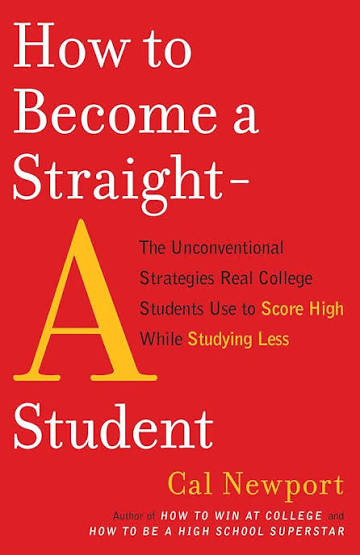
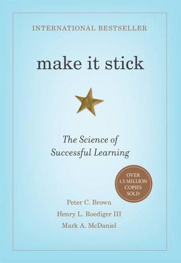

```{=html}
<style>

/* =========================================================
   Lecture Styling
   ========================================================= */

/* ---------------------------------------------------------
   Typography
   Keep lecture text consistent throughout the document
   --------------------------------------------------------- */

body {
  color: #212529;
}

blockquote {
  color: #212529;
  font-size: inherit;
  font-style: normal;
  font-weight: normal;
}

blockquote strong {
  color: #212529;
}

.text-center {
  color: #212529;
}


/* =========================================================
   Responsive Mobile Layout
   Stack ALL Quarto columns on narrow screens
   ========================================================= */

@media (max-width: 768px) {

  .columns {
    display: block !important;
  }

  .columns > .column {
    width: 100% !important;
    max-width: 100% !important;
    flex: 0 0 100% !important;
  }

  .columns > .column:empty {
    display: none !important;
  }

  img {
    max-width: 100%;
    height: auto;
  }

  p,
  li,
  figcaption {
    overflow-wrap: anywhere;
  }
}


/* =========================================================
   Poll Everywhere Layout
   ========================================================= */

@media (min-width: 501px) {

  .poll-columns {
    display: flex !important;
    align-items: center !important;
  }

  .poll-columns > .column {
    flex: initial !important;
  }
}

</style>
```

:::::: columns
::: {.column width="40%"}
{fig-alt="Mount Rainier photographed by Yoni Rodriguez in June 2022"}
:::

::: {.column width="4%"}
:::

::: {.column width="56%"}
## SHM 102: Occupational Health

### Welcome to SHM 102

**Lecture 00 · Fall 2026**

Yoni Rodriguez\
Engineering Technologies, Safety, and Construction\
Central Washington University\
[Yoni.Rodriguez\@cwu.edu](mailto:Yoni.Rodriguez@cwu.edu)
:::
::::::

# Welcome

Welcome to **SHM 102: Occupational Health**.

Before we talk about the syllabus, assignments, grades, or what occupational health means, I want us to learn a little about each other.

Today we will talk about:

- Who am I?
- Who are you?
- How does SHM 102 work?
- What can you expect from me?
- What do I expect from you?
- How can you succeed in this course?
- How do you communicate with professors?
- What resources are available to you at CWU?

# Who am I?

:::::: columns
::: {.column width="44%"}
.](nasa-award.jpg){fig-alt="Yoni Rodriguez receiving the 2024 Peer Award at NASA Armstrong Flight Research Center"}
:::

::: {.column width="5%"}
:::

::: {.column width="51%"}
## Before CWU

**Environmental Health Scientist**\
NASA Armstrong Flight Research Center

## Education

**B.S. Biochemistry & Molecular Biosciences**\
Washington State University

**M.S. Exposure Science**\
University of Washington

## Today

**Assistant Professor**\
Central Washington University

**Research Scientist**\
University of Washington
:::
::::::

# My Path Here

My path into occupational health was not completely linear.

I began in **biochemistry and molecular biosciences**, where I became interested in how biological and chemical processes affect human health.

At the University of Washington, that interest expanded into **exposure science**: understanding what people are exposed to, how exposure occurs, how we measure it, and what it may mean for health.

My work has included occupational and environmental health research involving:

- anencephaly + water quality
- wildfire smoke | respiratory health
- heavy metals | lead exposure 
- heat stress
- environmental exposure monitoring

At NASA Armstrong Flight Research Center, I worked in code 260 which is medical as an environmental public health scientist. I supported missions involving chemical, radiation, and biological exposures. 

Today, I teach occupational health here at CWU while continuing research with the University of Washington.

::: callout-note
## Why am I telling you this?

There is not one path into occupational health.

People enter this field through safety, biology, chemistry, engineering, environmental science, public health, medicine, sociology, and many other disciplines.

During this course, you may discover connections to interests you already have.
:::

# Tell Me About You

Before we get started, I'd like to learn a little about who's in the room.

### Poll Everywhere: First-Time Setup

::::::: {.columns .poll-columns}
::: {.column width="68%"}
1. Scan the QR code.
2. Sign in/register using your **CWU account**.
3. Complete the **Tell Me About You** survey.
4. We'll use this same response page throughout SHM 102.
:::

::: {.column width="4%"}
:::

:::: {.column width="28%"}
::: {style="display:flex; justify-content:center; align-items:center; height:100%;"}
{fig-alt="Poll Everywhere QR code and response link for SHM 102" width="250"}
:::
::::
:::::::

### Tell Me About You

The survey includes six questions:

1. **What is your year at CWU?**
2. **What is your major?**
3. **Are you a transfer student?**
4. **Have you taken a course related to occupational health before?**
5. **What are you hoping to get out of SHM 102?**
6. **When you hear "occupational health," what comes to mind?**

------------------------------------------------------------------------

# What Is This Course?

SHM 102 explores the **fundamentals and origins of occupational health through the history of public health**.

We will examine how people came to recognize connections between:

- work and health,
- environments and exposure,
- disease and prevention,
- scientific evidence and policy,
- and hazards and methods of control.

Understanding this history helps us understand **why occupational health exists today**.

# Why Does the History Matter?

The protections, policies, research methods, and control strategies we use today did not develop all at once.

They developed as people asked questions such as:

- Why are certain groups of people becoming sick or injured?
- Who is being exposed?
- What is causing the harm?
- What evidence do we need to understand the problem?
- Who decides what level of risk is acceptable?
- What should employers, governments, and communities do about it?
- Who is affected by those decisions?

Throughout the course, we will connect these questions to historical and modern occupational health cases.

# From History to Occupational Health

As we move through the history of public health, we will see the development of ideas that remain central to occupational health today:

::: {.text-center}
## Observation → Evidence → Exposure → Health Effects → Prevention → Policy
:::

We will examine how observations of illness and injury led to scientific investigation, how evidence helped identify hazards and exposures, and how that knowledge shaped approaches to prevention, control, and policy.

Just as importantly, we will ask:

- Who was affected?
- Who was studied?
- Who benefited from new protections?
- Who remained exposed?
- How were decisions about health and acceptable risk made?

These are not only historical questions. They remain central to occupational health today.

You do not need to know all of this already.

By the end of the quarter, I want you to be able to look at an occupational health problem and understand not only **what is happening**, but also **how we know, who is affected, and what can be done about it**.

# How SHM 102 Works

Class meetings may include:

- interactive lectures,
- real occupational and environmental health cases,
- current events,
- scientific articles,
- Poll Everywhere questions,
- individual activities,
- small-group discussions,
- data and figures,
- and problems where there may not be one obvious answer.

The first part of the course will use immersive lectures and historical cases to introduce you to the world of occupational health and build the foundations we will use throughout the quarter.

As the course progresses, you will increasingly use those foundations to examine evidence, discuss cases, investigate occupational health problems, and develop your own recommendations.

You are not expected to enter SHM 102 already knowing occupational health.

You are expected to engage with the material, ask questions, practice applying new concepts, and communicate when you need help.

# Where Should I Look?

## Canvas

Use Canvas for:

- announcements,
- assignments,
- deadlines,
- grades,
- submissions,
- copyrighted readings,
- and course-specific instructions.

## Course Repository

Instructor-created public materials may also be available through the [SHM 102 Occupational Health GitHub repository](https://github.com/yoni-rodriguez/shm-102-occupational-health.git).

The repository provides another way to access course lectures, resources, assignment instructions, and other publicly available materials.

The goal is for you to be able to return to these materials later in the SHM program and throughout your professional career.

# Major Assessments

| Assessment                  |  Points |  Percent |
|-----------------------------|--------:|---------:|
| Midterm: Foundations        |     100 |      25% |
| Engagement & Current Events |     100 |      25% |
| Final Project               |     200 |      50% |
| **Total**                   | **400** | **100%** |

The Final Project is the largest assessment because this course emphasizes **application**, not just memorization.

# Engagement Is More Than Attendance

Engagement can include:

- answering Poll Everywhere questions,
- participating in case discussions,
- asking questions,
- completing short reflections,
- working with classmates,
- examining current events,
- peer review,
- and participating during final presentations.

You do not have to be the loudest person in the room.

You do need to make a genuine effort to participate.

# Communicate Early

If something is affecting your ability to participate or complete your work:

::: text-center
## Let me know as soon as possible.
:::

A problem that we know about early gives us more options.

Waiting until the end of the quarter can make problems much harder to solve.

# Learning How to Learn

College requires more than simply spending time studying.

**How you study matters.**

This quarter, I want you to experiment with how you learn.

That is one reason the course includes an optional study-skills extra credit opportunity.

# Extra Credit: Learn About Learning

You may read an approved chapter from one of two books and try applying what you learn to your own coursework.

:::::: columns
::: {.column width="46%"}

{fig-alt="Cover of How to Become a Straight-A Student by Cal Newport" width="280"}

### *How to Become a Straight-A Student*

**Cal Newport**

Practical strategies for managing college work and studying effectively.

#### Plan your work

Instead of:

> "I'll work on SHM 102 sometime tonight."

Try:

> "From 4:00–4:45 PM, I will review today's SHM 102 material."

Give your work a specific time and place.

#### Work deeply

Create periods of focused work where you can give a difficult task your full attention.

Reduce distractions, protect the time you set aside, and focus on **one demanding task at a time**.

Forty-five focused minutes can be very different from forty-five minutes spent repeatedly switching between studying, messages, social media, and other tasks.

#### Take useful notes

Do not try to write down every word.

Listen for:

- important ideas,
- explanations,
- examples,
- relationships between concepts,
- and questions you still have.

Your notes should help you **think about the material later**, not simply reproduce everything that was said.

:::

::: {.column width="8%"}
:::

::: {.column width="46%"}

{fig-alt="Cover of Make It Stick: The Science of Successful Learning by Peter C. Brown, Henry L. Roediger III, and Mark A. McDaniel" width="280"}

### *Make It Stick*

**Peter C. Brown, Henry L. Roediger III, and Mark A. McDaniel**

Strategies based on research into learning and memory.

#### Practice retrieval

Instead of only putting information **into** your brain, practice pulling information **out**.

After class:

1. Close your notes.
2. Write down what you remember.
3. Reopen your notes and compare.

Ask yourself:

- What did I remember?
- What did I forget?
- What did I misunderstand?

#### Don't confuse familiarity with learning

Rereading something can make it look familiar.

That does not necessarily mean you can explain or use it.

Close your notes and ask:

> **What can I explain without looking?**

#### Space your practice

Return to important ideas over time rather than trying to learn everything in one long study session.

For example:

**Learn → Wait → Retrieve → Check → Return later**

#### Mix what you practice

As you learn more concepts, practice deciding **which idea applies to a problem** rather than studying every concept completely in isolation.

That ability to recognize and apply the appropriate concept is part of learning.

:::
::::::

# Try It Yourself

For the extra credit reflection:

1. Read an approved chapter from either book.
2. Identify an idea that seems useful to you.
3. Connect it to how you currently approach learning.
4. **Try the strategy.**
5. Reflect on what happened.

You do not have to decide that the strategy worked.

The goal is to experiment with your own learning and think about the results.

**Maximum: 10 extra credit points**

# Communicating With Professors

.](campus-map-cwu.jpg){fig-alt="Aerial view of the Central Washington University campus"}

College may be the first time you regularly communicate with professors outside of a classroom.

There are some simple professional habits that can make those interactions easier.

## Faculty Are Different

Faculty have different:

- personalities
- expectations
- communication styles
- schedules
- research interests
- approaches to teaching
- preferences for how students communicate with them

You do not need a special script to speak with a professor.

Start with the same principles you would use in a professional workplace:

::: text-center
### Be respectful. Be clear. Provide context. Ask for what you need.
:::

## Approaching a Professor's Office

If you visit a professor's office:

- **Knock before entering**, even if the door is open.
- Wait for the professor to invite you in.
- Introduce yourself if the professor may not know you yet.
- Ask whether it is a good time to talk.
- Do not assume an open office door means you should enter and sit down.
- If the professor is meeting with someone else, give them privacy and come back later.

You can simply say:

> "Hi Professor Rodriguez, do you have a few minutes?"

If it is not a good time, ask when you should come back or whether you should schedule an appointment.

::: callout-note
## What about office hours?

**Office hours are specifically reserved for students.**

You are welcome to come during my scheduled drop-in office hours without making an appointment first.

Mondays and Wednesdays 10:00 am - 11:30 am
:::

# Before You Email

Ask yourself:

1. **What am I asking?**
2. **What information does the professor need to answer me?**
3. **Would this be easier to discuss in person?**

Email works well for:

- quick questions
- clarification
- absence notifications
- scheduling
- simple requests

Complex questions about an assignment, your performance in the course, a grade, or personal circumstances may be easier to discuss during office hours or an appointment.

# A Useful Email Structure

You do not need to write a long or overly formal email.

Give the professor enough information to understand **who you are and what you need**.

### Subject

**SHM 102 Question About [Topic or Assignment]**

### Greeting

Hello Professor Rodriguez,

### Context

I'm in your 9:00 AM SHM 102 course.

### Question

I'm working on [assignment/topic], and I have a question about...

### What you've already tried

I reviewed [lecture/Canvas/instructions], but I'm still unsure about...

### Close

Thank you,\
[Your Name]

# Example Email

> **Subject:** SHM 102 Question About Exposure Pathways
>
> Hello Professor Rodriguez,
>
> I'm reviewing today's SHM 102 lecture and had a question about exposure pathways. I understand inhalation and ingestion, but I'm still having trouble distinguishing dermal contact from dermal absorption.
>
> I reviewed the lecture example, but could you explain the difference or point me toward another example?
>
> Thank you,\
> [your name]

# Asking About a Grade

It is completely appropriate to ask questions about your grade or feedback.

For example:

> "Could you help me understand where I lost points?"

or

> "I reviewed the feedback and had a question about this section."

or

> "What should I improve before the next assignment?"

Those questions give us something useful to discuss.

If you think something may have been graded incorrectly, you can ask about that too.

The goal is to understand **how your work was evaluated and what you can do next**.

# Office Hours

Office hours are time specifically reserved for students.

For SHM 102:

::: text-center
### Monday & Wednesday

### 10:00–11:30 AM

### Drop in
:::

You do **not** need an appointment during scheduled drop-in hours.

# You Don't Need to Have a Problem

Come to office hours to:

- ask about something from class,
- review a difficult concept,
- discuss your Final Project,
- ask about careers,
- talk about internships,
- discuss research,
- get feedback,
- or simply introduce yourself.

# "I Don't Know What to Ask"

That's okay.

You can approach and say:

> "I'm having trouble understanding engineering controls."

or

> "I don't know where to start on this assignment."

or even:

> "I understand the lecture when you're explaining it, but when I study by myself I get lost."

That gives us somewhere to start.

# Use Your Resources

You have access to more than this classroom.

CWU provides resources to support you throughout your time at the university.

- **Academic support:** [Learning Commons](https://www.cwu.edu/academics/academic-resources/learning-commons/tutoring/index.php)
- **Research and library assistance:** [CWU Libraries](https://www.lib.cwu.edu/)
- **Academic advising:** [Academic Advising](https://www.cwu.edu/academics/academic-resources/academic-advising/index.php)
- **Accessibility and accommodations:** [Disability Services](https://www.cwu.edu/student-life/student-support/disability-services/index.php)
- **Counseling and wellbeing:** [Student Counseling Services](https://www.cwu.edu/student-life/health-wellness-services/counseling-services/index.php)
- **Career development:** [Career Services](https://careerservices.cwu.edu/)
- **Technology:** [Technology Resources](https://www.cwu.edu/academics/colleges/college-business/student-resources/technology-resources.php)

Part of succeeding in college is learning **where to go when you need something**.

# CWU Libraries

On **Monday, September 28**, we will meet at the:

::: text-center
### CWU Library

### 9:00–9:50 AM
:::

We will explore:

- CWU library resources,
- OneSearch,
- finding physical and digital materials,
- ScienceDirect,
- and finding credible occupational health evidence.

These skills will become important for your Final Project.

# When Life Happens

Illness happens.

Emergencies happen.

Transportation problems happen.

Family situations happen.

Unexpected things happen.

The important professional habit is:

::: text-center
## Communicate.
:::

You do not need to provide unnecessary personal details.

Tell me what I need to know so that we can determine the appropriate next step.

## Example Message

> **Subject:** SHM 102 Absence
>
> Hello Professor Rodriguez,
>
> I won't be able to attend SHM 102 today because of an unexpected personal situation. I will check Canvas and review the course materials I missed.
>
> Please let me know if there is an in-class activity or anything else I should follow up on.
>
> Thank you,\
> [your name]

Notice what the message does:

- explains that the student will be absent,
- communicates as early as possible,
- shows that they will check the available course materials,
- asks what they need to do next,
- and does **not** require them to share private details.

The goal is not to explain everything that happened.

The goal is to **communicate what is affecting the course and determine the next step**.

# Professional Habits Start Now

Your professional reputation does not suddenly begin after graduation.

Practice now:

- showing up and participating
- communicating
- meeting commitments
- asking questions
- listening
- accepting feedback
- checking your work
- admitting when you don't know something
- finding credible information
- and treating people respectfully

These habits transfer far beyond SHM 102.

# Clear \> Complicated

Professional communication does not mean using the biggest words possible.

Your goal is to communicate information:

**accurately**

and

**in a way your audience can understand.**

That will matter throughout occupational health.

# Important Dates

### September 28

**CWU Libraries Session**\
Meet at the CWU Library from 9:00–9:50 AM.

### September 29

**Last day of the regular CWU Change of Schedule Period**

### September 30

SHM 102 moves from **Hogue 102** to **Hogue 229**.


# Questions?

### Welcome to SHM 102.

Let's have a good quarter.

------------------------------------------------------------------------

© 2026 Yoni Rodriguez. SHM 102: Occupational Health. Except where otherwise noted, instructor-created course materials are licensed under CC BY-NC 4.0.
