---
format:
  html:
    toc: true
    toc-location: right
    smooth-scroll: true
    code-fold: true
    embed-resources: true
editor: visual
---

:::::: columns
::: {.column width="40%"}
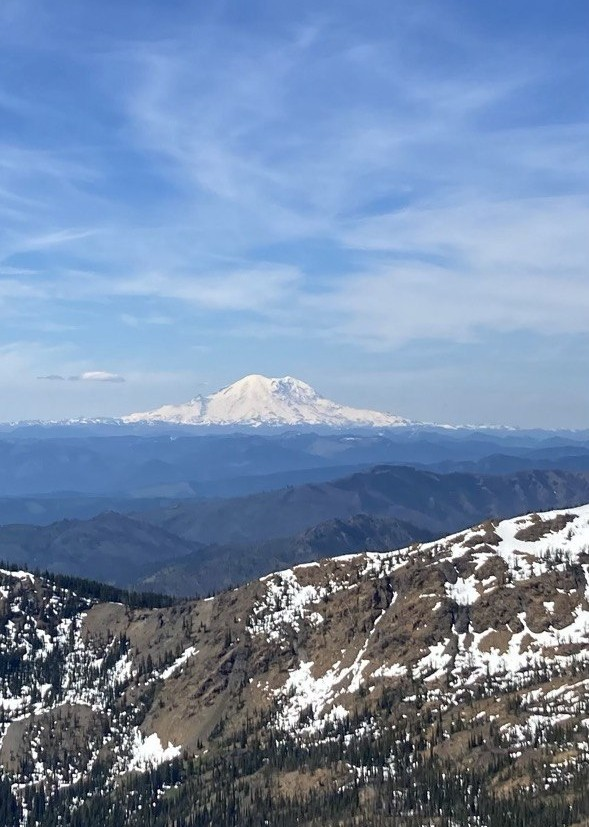{fig-alt="Mount Rainier photographed by Yoni Rodriguez in June 2022"}
:::

::: {.column width="4%"}
:::

::: {.column width="56%"}
## SHM 102: Occupational Health

### Introduction to Occupational Health

**Lecture 01 · Fall 2026**

Yoni Rodriguez\
Engineering Technologies, Safety, and Construction\
Central Washington University\
[Yoni.Rodriguez\@cwu.edu](mailto:Yoni.Rodriguez@cwu.edu)
:::
::::::

# Introduction

- Who am I?
- What is occupational health?
- Where does occupational health fit?
- What will we do in this course?

# Who am I?

:::::: columns
::: {.column width="44%"}
.](nasa-award.jpg){fig-alt="Yoni Rodriguez receiving the 2024 Peer Award at NASA Armstrong Flight Research Center"}
:::

::: {.column width="5%"}
:::

::: {.column width="51%"}
## Before CWU

**Occupational Health Scientist**\
NASA

## Education

**B.S. Biochemistry**\
Washington State University

**Graduate Training**\
University of Washington

## Today

**Assistant Professor**\
Central Washington University

**Research Scientist**\
University of Washington
:::
::::::

# Tell Me About You

Before we get started, I'd like to learn a little about who's in the room.

### Poll Everywhere: First-Time Setup

1.  Scan the QR code below.
2.  Sign in/register using your **CWU account**.
3.  Complete the **Tell Me About You** survey.
4.  We'll use this same response page throughout SHM 102.

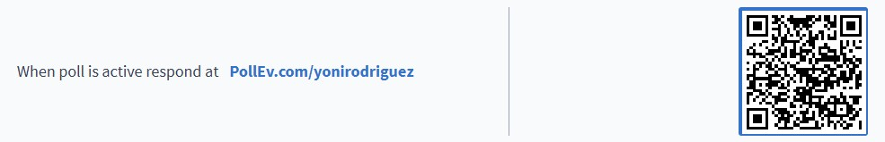{fig-alt="Poll Everywhere QR code and response link for SHM 102" width="700"}

**Today's survey:**

- What is your year in school?
- What is your major?
- Are you a transfer student?
- Have you taken a course related to occupational or environmental health before?

# What is Occupational Health?

## Before We Define It...

Let's start with what you already think.

### Poll Everywhere

1.  **What comes to mind when you hear the term "occupational health"?**
2.  **In your own words, how would you define occupational health?**

There is no expectation that you know the formal definition yet. Give me your best answer.

::: {style="text-align:center; margin: 2rem 0;"}
{fig-alt="QR code to join the SHM 102 Poll Everywhere presentation" width="250"}

**Scan the QR code to respond.**
:::

::: {style="text-align:center; margin: 4rem 0;"}
### A working definition

**"*Occupational and environmental health is the study and prevention of health problems caused or influenced by the environments where people work, live, and interact.*" - Centers for Disease Control and Prevention (CDC)**
:::

:::: {style="text-align:center; margin: 4rem 0;"}
## Where does Occupational Health occur?

::: {style="display:inline-block; text-align:left;"}
- **Do you get exposed on your way to work?**
- **Does the community nearby get exposed?**
- **Do you take the exposures home?**
:::
::::

:::: {style="text-align:center; margin: 4rem 0;"}
## Why is Occupational Health important?

::: {style="display:inline-block; text-align:left;"}
- **Does this impact my health?**
- **Does this impact the health of my family?**
- **Does this impact the health of my community?**
:::
::::

# Current News

[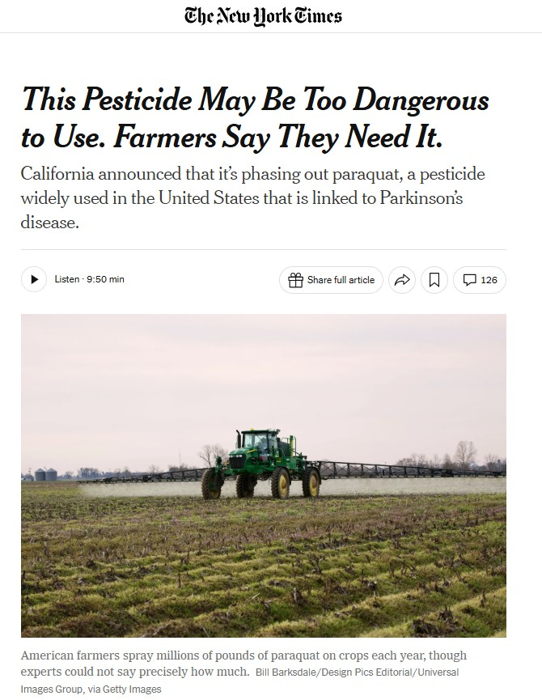{fig-alt="New York Times article titled This Pesticide May Be Too Dangerous to Use. Farmers Say They Need It." width="90%"}](https://www.nytimes.com/2026/08/13/science/paraquat-pesticide-parkinsons-california.html)

*The New York Times*, August 13, 2026.\
[Read the article →](https://www.nytimes.com/2026/08/13/science/paraquat-pesticide-parkinsons-california.html)

# Where is paraquat used?

[{fig-alt="USGS map showing estimated agricultural paraquat use across the United States in 2018, with higher estimated use concentrated in agricultural regions." width="90%"}](https://water.usgs.gov/nawqa/pnsp/usage/maps/show_map.php?year=2018&map=PARAQUAT&hilo=L&disp=Paraquat)

*Source: U.S. Geological Survey.*\
[Explore paraquat use map →](https://water.usgs.gov/nawqa/pnsp/usage/maps/show_map.php?year=2018&map=PARAQUAT&hilo=L&disp=Paraquat)

# Who is exposed?

{fig-alt="Agricultural pesticide application with fluorescent tracer visible during application." width="90%"}

## Where was the applicator exposed?

:::::: columns
::: {.column width="47%"}
{fig-alt="Fluorescent tracer visible on an agricultural applicator's face following pesticide application."}
:::

::: {.column width="6%"}
:::

::: {.column width="47%"}
{fig-alt="Fluorescent tracer visible on an agricultural applicator's hand following pesticide application."}
:::
::::::

# Is the applicator the only person exposed?

## Pesticide drift in Washington State

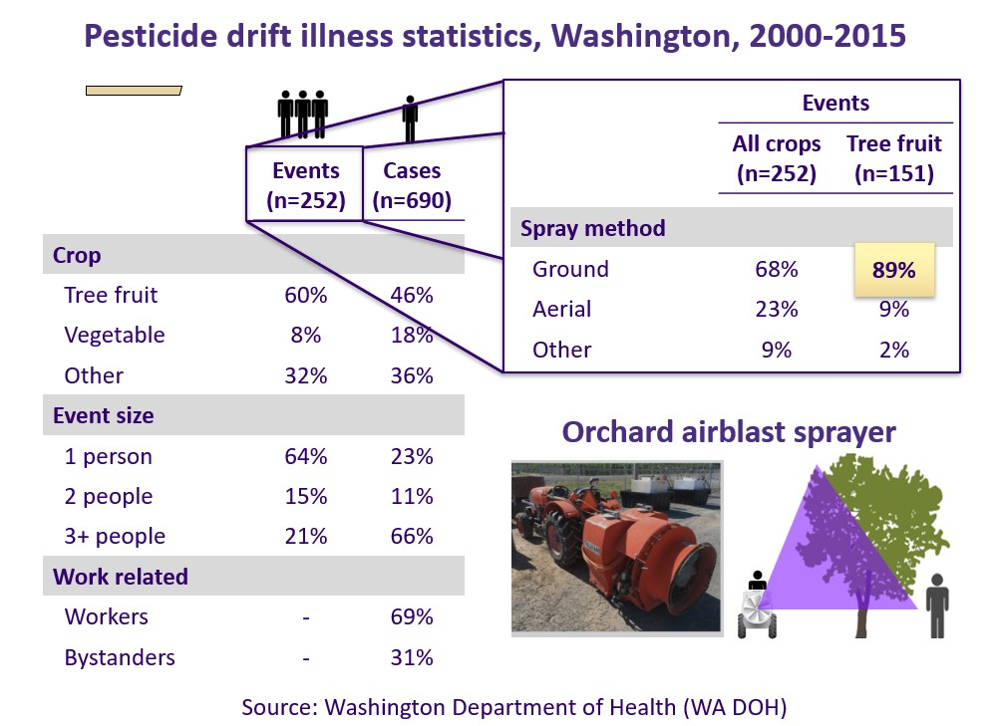{fig-alt="Number of pesticide drift events and confirmed cases by year, month, weekday, and hour in Washington State, 2000–2015." width="90%"}

*Source: Kasner et al. (2021), Environmental Health.*\
[View study on PubMed →](https://pubmed.ncbi.nlm.nih.gov/33722241/)

# What happens when exposure occurs?

## Paraquat: acute toxicity

:::::: columns
::: {.column width="20%"}
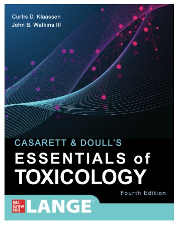{fig-alt="Cover of Casarett and Doull's Essentials of Toxicology." width="100%"}
:::

::: {.column width="4%"}
:::

::: {.column width="76%"}
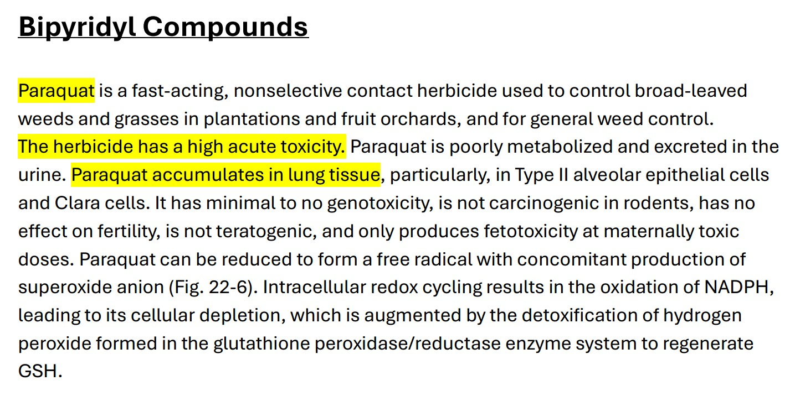{fig-alt="Highlighted textbook excerpt describing paraquat as highly acutely toxic and noting accumulation in lung tissue." width="100%"}
:::
::::::

*Source: Costa (2021), "Toxic Effects of Pesticides," in Casarett & Doull's Essentials of Toxicology.*\
[View textbook chapter →](https://accesspharmacy-mhmedical-com.offcampus.lib.washington.edu/content.aspx?bookid=3000&sectionid=252315470)

## What can severe acute exposure do?

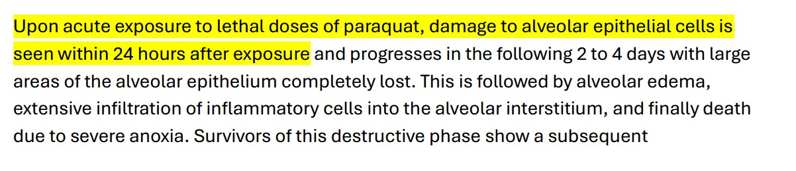{fig-alt="Highlighted textbook excerpt stating that lethal doses of paraquat can damage alveolar epithelial cells within 24 hours after exposure." width="95%"}

*Source: Costa (2021), "Toxic Effects of Pesticides," in Casarett & Doull's Essentials of Toxicology.*\
[View textbook chapter →](https://accesspharmacy-mhmedical-com.offcampus.lib.washington.edu/content.aspx?bookid=3000&sectionid=252315470)

## What about long-term health?

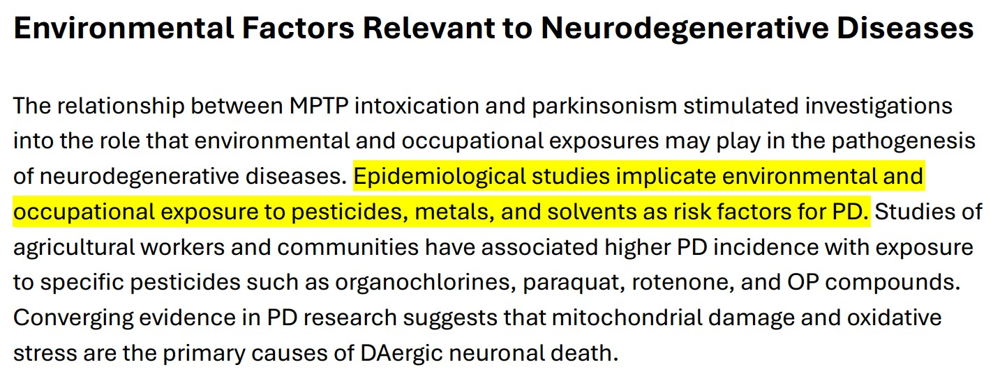{fig-alt="Highlighted textbook excerpt describing epidemiologic evidence implicating environmental and occupational pesticide exposure as risk factors for Parkinson's disease." width="95%"}

*Source: Moser et al. (2021), "Toxic Responses of the Nervous System," in Casarett & Doull's Essentials of Toxicology.*\
[View textbook chapter →](https://accesspharmacy-mhmedical-com.offcampus.lib.washington.edu/content.aspx?bookid=3000&sectionid=252314425)

# What did we just do?

::: {style="text-align:center; margin: 3rem 0;"}
### We identified a **hazard**

**Paraquat**

### ↓

### We asked **where it is used**

**Agricultural workplaces and environments**

### ↓

### We identified **who can be exposed**

**Applicators → Coworkers → Bystanders → Communities**

### ↓

### We examined **how people are exposed**

**Dermal contact → Inhalation → Ingestion**

### ↓

### We considered **what happens after exposure**

**Toxicity → Health effects → Health risks**
:::

# This is Occupational Health

::::::::::::::: {style="text-align:center; margin: 3rem 0;"}
# How to Apply Occupational Health

::: {style="text-align:center;"}
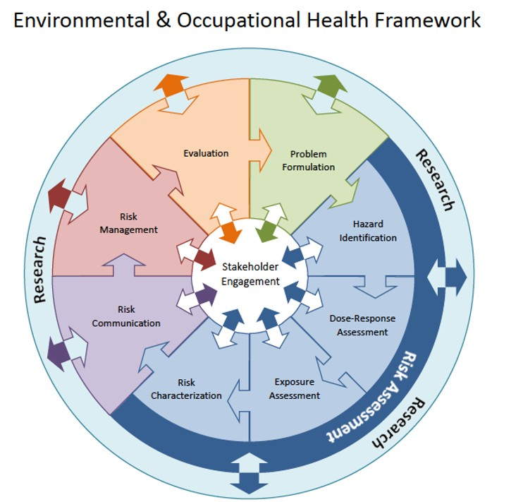{fig-alt="University of Washington Environmental and Occupational Health Framework showing problem formulation, hazard identification, dose-response assessment, exposure assessment, risk characterization, risk communication, risk management, evaluation, research, and stakeholder engagement." width="72%"}

*Source: University of Washington Department of Environmental & Occupational Health Sciences.*\
[Explore the ENV H 501 course framework →](https://deohs.washington.edu/sites/default/files/course-materials/2023_AUT_ENV_H_501.pdf)
:::

# How do we control exposure?

::: {style="text-align:center; margin: 4rem 0;"}
## If a hazard can affect health...

### What can we do about it?
:::

# Hierarchy of Controls

::: {style="text-align:center;"}
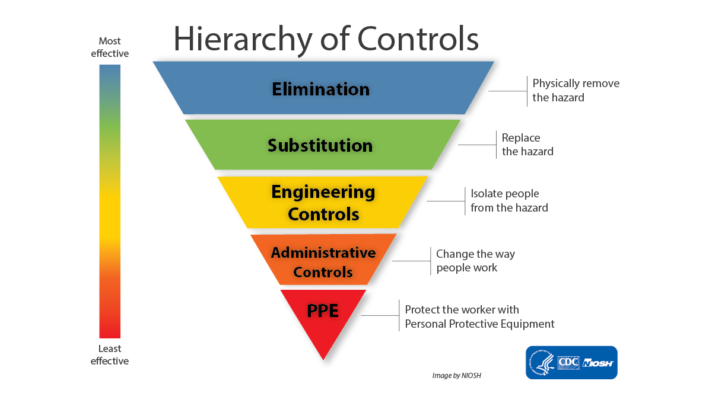{fig-alt="NIOSH Hierarchy of Controls showing elimination, substitution, engineering controls, administrative controls, and personal protective equipment from most effective to least effective." width="85%"}

*Source: National Institute for Occupational Safety and Health (NIOSH).*\
[Explore the Hierarchy of Controls →](https://www.cdc.gov/niosh/hierarchy-of-controls/about/index.html)
:::

# Apply it to our case

::: {style="text-align:center; margin: 4rem 0;"}
## How could we reduce pesticide exposure?

### Where would you intervene?
:::

## Apply the Hierarchy of Controls

Take a couple of minutes to discuss with your classmates.

Using the **Hierarchy of Controls**, consider:

1.  **What could we do to reduce or prevent pesticide exposure?**
2.  **Where in the hierarchy would your intervention fall?**
3.  **Why would your approach reduce exposure?**

When you're ready, submit your group's response through Poll Everywhere.

::: {style="text-align:center; margin: 2rem 0;"}
{fig-alt="QR code to join the SHM 102 Poll Everywhere presentation" width="250"}

**Scan the QR code to respond.**
:::

# What could prevention look like?

::: {style="text-align:center; margin: 3rem 0;"}
## Can we measure environmental conditions...

## ...and use that information before exposure occurs?
:::

# Measuring the environment

[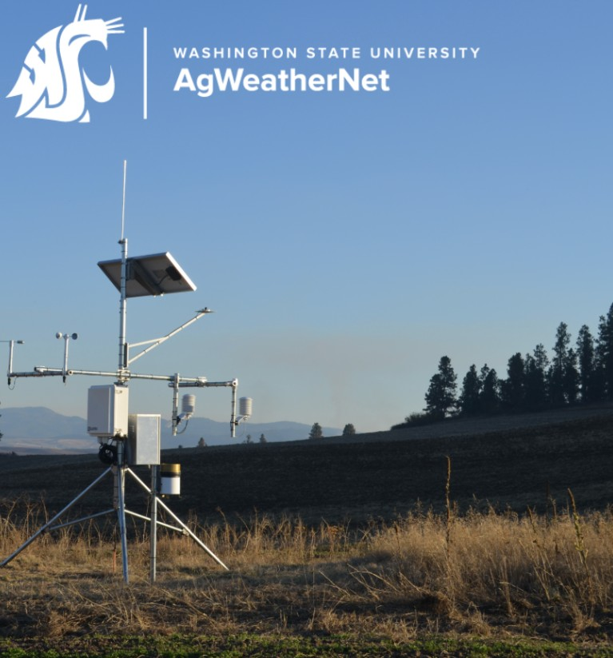{fig-alt="Washington State University AgWeatherNet agricultural weather monitoring station." width="65%"}](https://weather.wsu.edu/login)

*Source: Washington State University AgWeatherNet.*\
[Explore AgWeatherNet →](https://weather.wsu.edu/login)

# From measurement to prediction

[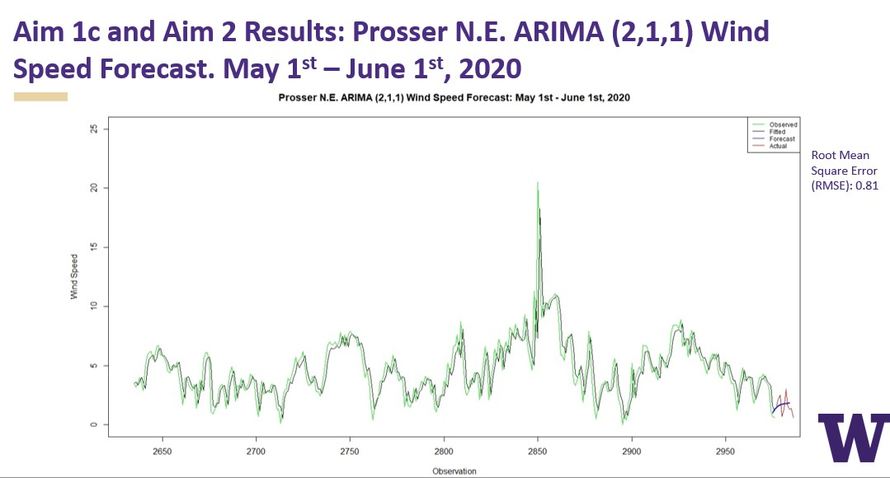{fig-alt="Observed wind speeds and short-term wind speed forecast from the Prosser Northeast AgWeatherNet station." width="90%"}](https://deohs.washington.edu/student-research/yoni-rodriguez)

*Source: Rodriguez, Y. — Exploring Wind Ramping as a Determinant of Pesticide Drift, University of Washington DEOHS.*\
[View research project →](https://deohs.washington.edu/student-research/yoni-rodriguez)

# Where does this fit in the Hierarchy of Controls?

:::::: columns
::: {.column width="47%"}
{fig-alt="Administrative controls section of the NIOSH Hierarchy of Controls, described as changing the way people work." width="100%"}

## Administrative Control

**Forecast → Alert → Delay or reschedule application**
:::

::: {.column width="6%"}
:::

::: {.column width="47%"}
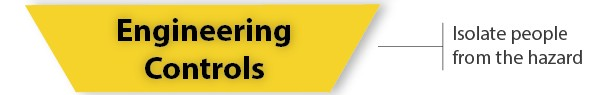{fig-alt="Engineering controls section of the NIOSH Hierarchy of Controls, described as isolating people from the hazard." width="100%"}

## Engineering Control

**Forecast → Equipment responds → Modify or stop application**
:::
::::::

*Source: National Institute for Occupational Safety and Health (NIOSH).*\
[Explore the Hierarchy of Controls →](https://www.cdc.gov/niosh/hierarchy-of-controls/about/index.html)

# What will we explore?

## Five broad categories of occupational hazards

::: {style="font-size: 1.5em; margin-top: 2rem;"}
- **Chemical**
- **Physical**
- **Biological**
- **Ergonomic**
- **Psychosocial**
:::

# What will we learn in this course

::: {style="text-align:center; margin: 3rem 0;"}
## Identify Hazards

↓

## Measure Hazards

↓

## Assess Hazards

↓

## Control Hazards

<br>

### Understand exposure. Prevent harm.
:::

# Key Terms

### These are the terms I expect you to know from today's lecture for the mid-term.

| Term | What should you know? |
|----|----|
| **Occupational health** | Understanding and preventing health problems related to work and work environments |
| **Hazard** | Something with the potential to cause harm to human health |
| **Exposure** | Contact between a person and a hazard |
| **Exposure route** | How a hazard enters or contacts the body: inhalation, ingestion, or dermal contact |
| **Acute health effect** | A health effect occurring relatively soon after exposure |
| **Chronic health effect** | A health effect developing or persisting over a longer period |
| **Hierarchy of Controls** | A framework for selecting ways to prevent or reduce exposure (*know the hierarchy*) |
| **Administrative control** | Changing how or when people work |
| **Engineering control** | Isolating people from a hazard |

# Make your flashcards

### Copy → Paste → Study

Copy the terms below to make your own **Anki or Quizlet** flashcards.

**Anki:** Save as a `.txt` file → Import → Select **Semicolon** as the field separator.

```{=html}
<div style="font-size: 0.72em;">
<pre style="white-space: pre-wrap; padding: 1.25rem; border: 1px solid #ddd; border-radius: 8px;">
Occupational health;Understanding and preventing health problems related to work and work environments
Hazard;Something with the potential to cause harm to human health
Exposure;Contact between a person and a hazard
Exposure route;How a hazard enters or contacts the body: inhalation, ingestion, or dermal contact
Acute health effect;A health effect occurring relatively soon after exposure
Chronic health effect;A health effect developing or persisting over a longer period
Hierarchy of Controls;A framework for selecting ways to prevent or reduce exposure. Know the order: elimination → substitution → engineering controls → administrative controls → PPE
Administrative control;Changing how or when people work
Engineering control;Isolating people from a hazard
</pre>
</div>
```

------------------------------------------------------------------------

### Copyright & Use

**SHM 102: Occupational Health**\
© 2026 Yoni Rodriguez

Except where otherwise noted, original course materials are licensed under the Creative Commons Attribution-NonCommercial 4.0 International License (CC BY-NC 4.0).

Third-party materials remain subject to their respective copyright and licensing terms.
:::::::::::::::
