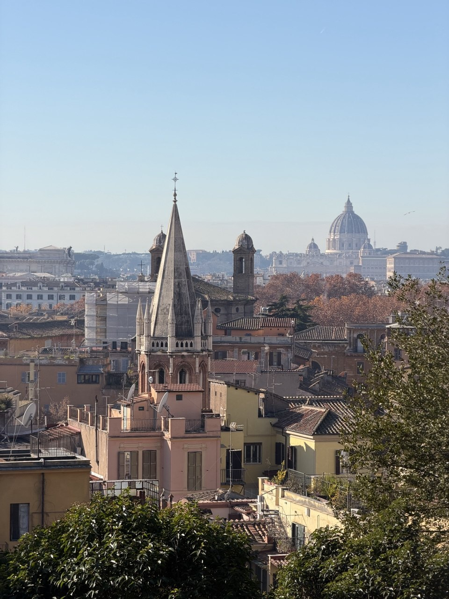
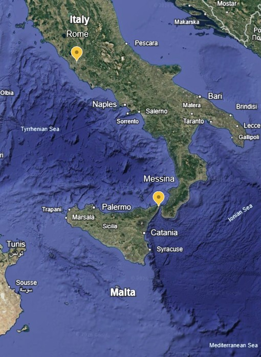
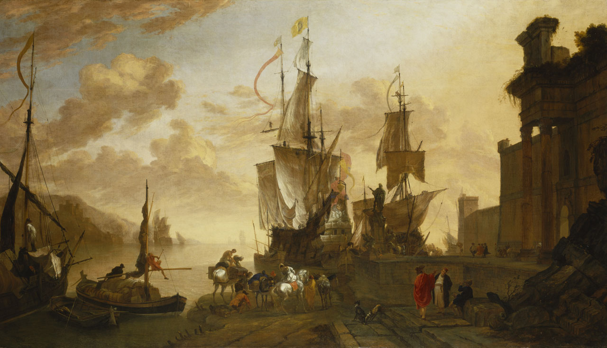
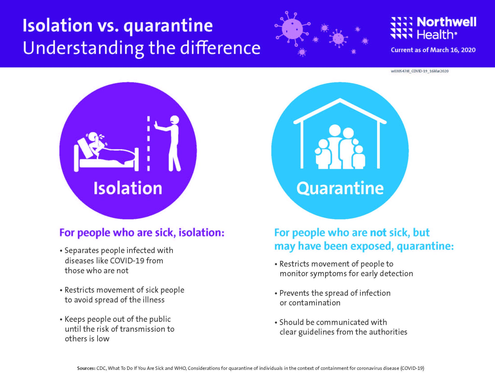
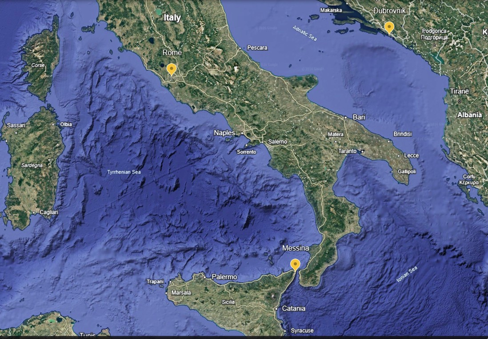
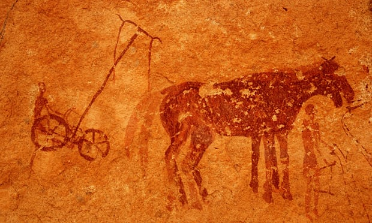
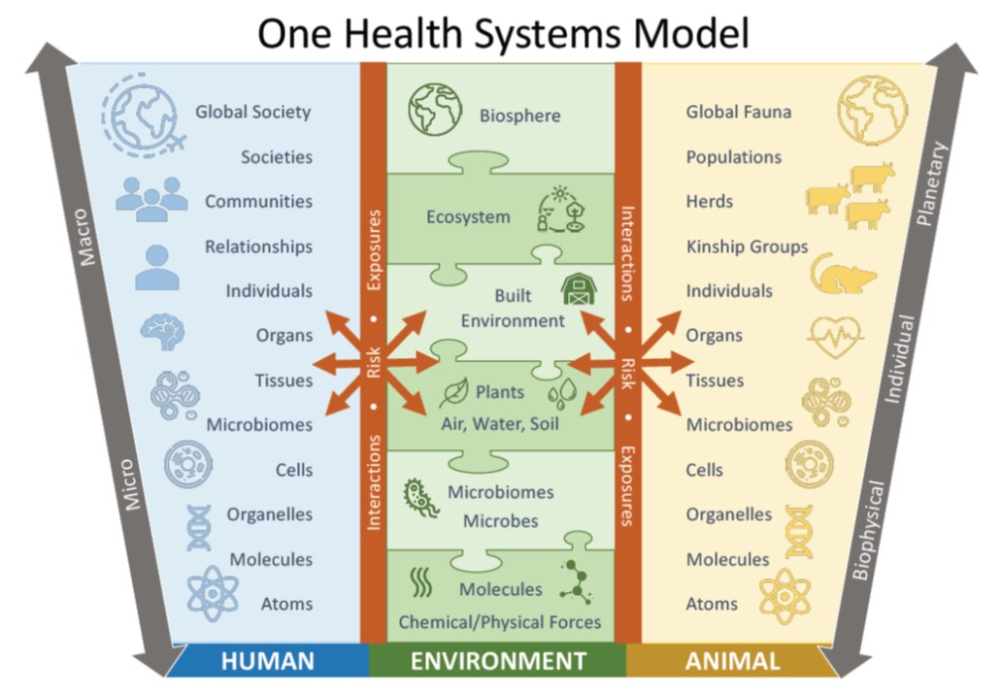
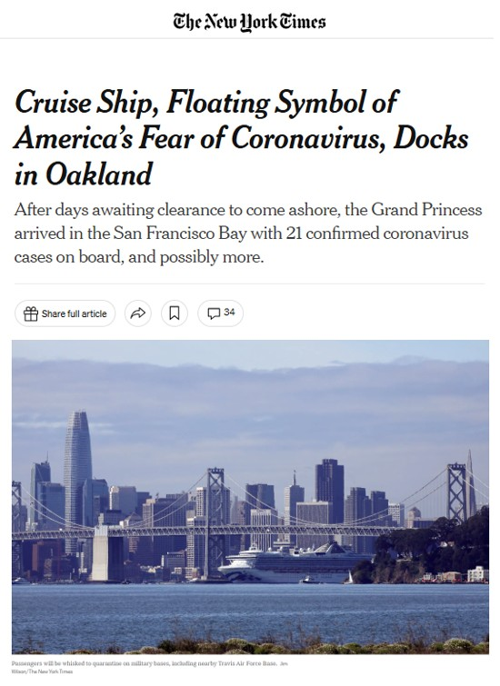
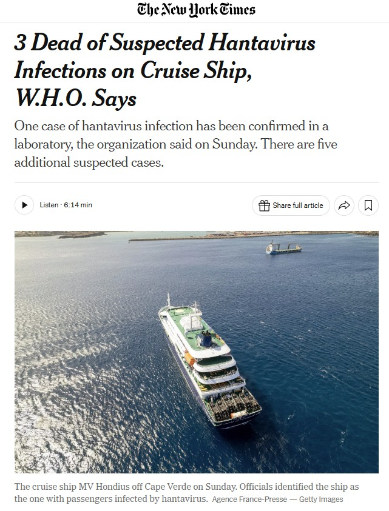

---
format:
  html:
    toc: true
    toc-location: right
    smooth-scroll: true
    code-fold: true
    embed-resources: true
  pdf:
    toc: true
    documentclass: scrartcl
    geometry:
      - margin=0.75in
editor: visual
---

```{=html}
<style>

/* =========================================================
   Lecture Styling
   ========================================================= */

/* ---------------------------------------------------------
   Typography
   Keep lecture text consistent throughout the document
   --------------------------------------------------------- */

body {
  color: #212529;
}

blockquote {
  color: #212529;
  font-size: inherit;
  font-style: normal;
  font-weight: normal;
}

blockquote strong {
  color: #212529;
}

.text-center {
  color: #212529;
}


/* =========================================================
   Responsive Mobile Layout
   Stack ALL Quarto columns on narrow screens
   ========================================================= */

@media (max-width: 768px) {

  .columns {
    display: block !important;
  }

  .columns > .column {
    width: 100% !important;
    max-width: 100% !important;
    flex: 0 0 100% !important;
  }

  .columns > .column:empty {
    display: none !important;
  }

  img {
    max-width: 100%;
    height: auto;
  }

  p,
  li,
  figcaption {
    overflow-wrap: anywhere;
  }

}


/* =========================================================
   Poll Everywhere Layout
   Keep instructions left and QR code right
   ========================================================= */

@media (min-width: 501px) {

  .poll-columns {
    display: flex !important;
    align-items: center !important;
  }

  .poll-columns > .column {
    flex: initial !important;
  }

}


/* =========================================================
   Agriculture Exposure Tree
   ========================================================= */

.ag-tree {
  width: 100%;
  max-width: 850px;
  text-align: center;
  margin: 2rem auto;
}

.ag-tree-parent {
  display: inline-block;
  padding: 1rem 2.5rem;
  border: 2px solid #495057;
  border-radius: 8px;
  font-size: 1.35em;
  font-weight: bold;
  background: #f8f9fa;
}

.ag-tree-stem {
  width: 2px;
  height: 40px;
  background: #495057;
  margin: 0 auto;
}


/* =========================================================
   Three Middle Branches
   ========================================================= */

.ag-tree-branches {
  position: relative;
  display: flex;
  justify-content: space-between;
  gap: 1rem;
  padding-top: 40px;
  padding-bottom: 40px;
}

/* Horizontal line connecting the three branches from above */
.ag-tree-branches::before {
  content: "";
  position: absolute;
  top: 0;
  left: 16%;
  right: 16%;
  height: 2px;
  background: #495057;
}

/* Horizontal line reconnecting the three branches below */
.ag-tree-branches::after {
  content: "";
  position: absolute;
  bottom: 0;
  left: 16%;
  right: 16%;
  height: 2px;
  background: #495057;
}

.ag-tree-category {
  position: relative;
  flex: 1;
  padding: 1rem 0.5rem;
  border: 2px solid #495057;
  border-radius: 8px;
  font-weight: bold;
  background: #f8f9fa;
}

/* Vertical lines entering the three boxes */
.ag-tree-category::before {
  content: "";
  position: absolute;
  width: 2px;
  height: 40px;
  background: #495057;
  top: -40px;
  left: 50%;
  transform: translateX(-50%);
}

/* Vertical lines leaving the three boxes */
.ag-tree-category::after {
  content: "";
  position: absolute;
  width: 2px;
  height: 40px;
  background: #495057;
  bottom: -40px;
  left: 50%;
  transform: translateX(-50%);
}


/* =========================================================
   Outcomes
   ========================================================= */

.ag-tree-outcome {
  display: inline-block;
  padding: 0.8rem 2rem;
  border: 2px solid #495057;
  border-radius: 8px;
  background: #f8f9fa;
  font-weight: bold;
}

.ag-tree-arrow {
  font-size: 1.5rem;
  line-height: 1;
  margin: 0.65rem 0;
}


/* =========================================================
   Mobile Layout
   ========================================================= */

@media (max-width: 600px) {

  .ag-tree-stem,
  .ag-tree-branches::before,
  .ag-tree-branches::after,
  .ag-tree-category::before,
  .ag-tree-category::after {
    display: none;
  }

  .ag-tree-branches {
    flex-direction: column;
    padding-top: 1rem;
    padding-bottom: 1rem;
  }

  .ag-tree-category {
    width: 100%;
  }

}

</style>
```


:::::: columns
::: {.column width="40%"}
{fig-alt="View across the historic cityscape of Rome from Pincian Hill, with the spire of All Saints' Anglican Church in the foreground and the dome of St. Peter's Basilica on the horizon"}
:::

::: {.column width="4%"}
:::

::: {.column width="56%"}
## SHM 102: Occupational Health

### Public Health History

**Lecture 02 · Fall 2026**

Yoni Rodriguez\
Engineering Technologies, Safety, and Construction\
Central Washington University\
[Yoni.Rodriguez\@cwu.edu](mailto:Yoni.Rodriguez@cwu.edu)
:::
::::::

# From Rome to Sicily

Our journey today begins in Rome, where the opening lecture photograph was taken from Pincian Hill in November 2025.

From Rome, we travel south through Italy to Messina, Sicily, a port city at the northeastern tip of the island and the starting point for our historical case.

Explore the map below. *Where is Messina in relation to Rome and the Mediterranean Sea?*

::: {style="text-align:center;"}
{fig-alt="Google Earth satellite map showing Rome in central Italy and Messina at the northeastern tip of Sicily." width="60%"}
:::

**Want to explore further?**\
[Explore Rome and Messina in Google Earth](https://earth.google.com/earth/d/1REktiSIZv4oKlCb-nx_vpPkC30PHFLX5?usp=sharing)

*Interactive Google Earth project created by Yoni Rodriguez.*

------------------------------------------------------------------------

# Travel back to 1347

## October 1347 · Messina, Sicily

{fig-alt="Painting of a busy Mediterranean harbor with large sailing ships at a quay, smaller boats, merchants, travelers, animals, and goods."}

*Hendrik van Minderhout, **Italianate harbour scene with the monument of Ferdinand I de' Medici at Leghorn**, 1670. National Maritime Museum, Greenwich. The painting depicts a later Mediterranean harbor scene and is used here to help visualize the maritime setting of our 1347 case.*

------------------------------------------------------------------------

# Something is wrong.

Merchant ships have arrived from the **Black Sea**.

Most of the sailors aboard are **dead**.

Many of those still alive are **gravely ill**.

<br>

::: {style="text-align:center; margin: 3rem 0;"}
### You are the Port Health Officer, What do you do?
:::

------------------------------------------------------------------------

# What would you want to know?

### Poll Everywhere

::::::: {.columns .poll-columns}
::: {.column width="68%"}
Before deciding what to do, *what information would help you understand what is happening?*

*What questions would you ask?*

Submit one question through Poll Everywhere.
:::

::: {.column width="4%"}
:::

:::: {.column width="28%"}
::: {style="display:flex; justify-content:center; align-items:center; height:100%;"}
{fig-alt="QR code to join the SHM 102 Poll Everywhere presentation" width="250"}
:::
::::
:::::::

------------------------------------------------------------------------

# What are we trying to figure out?

As a group, your questions may begin to fall into a few categories:

- **Who** is sick?
- **Where** did they come from?
- **When** did they become sick?
- **What symptoms** are they experiencing?
- **What did they have in common?**
- **What might they have been exposed to?**
- **Who else may have been exposed?**
- **Is the illness spreading?**

<br>

::: {style="text-align:center;"}
### We still do not know what is causing the illness.
:::

------------------------------------------------------------------------

# You have to make a decision.

You still do not know what is causing the illness.

### Poll Everywhere

::::::: {.columns .poll-columns style="margin-top: -0.200rem;"}
::: {.column width="68%"}
*What should you do with the arriving ships?*

Choose the response you think is most appropriate.

1.  Allow passengers and crew to disembark normally
2.  Allow only people who appear healthy to disembark
3.  Isolate the sick but allow everyone else ashore
4.  Keep the ships and everyone aboard separated from the population
5.  I need more information before deciding
:::

::: {.column width="4%"}
:::

:::: {.column width="28%"}
::: {style="display:flex; justify-content:center; align-items:center; height:100%;"}
{fig-alt="QR code to join the SHM 102 Poll Everywhere presentation" width="250"}
:::
::::
:::::::

------------------------------------------------------------------------

# How certain do you need to be before taking action?

You know that people are **severely ill**.

You know that many have **died**.

You know that the ships have traveled from somewhere else.

But you **do not know the cause**.

<br>

::: {style="text-align:center; margin: 2rem 0;"}
### Do you wait until you know more? Or act now to prevent additional illness?
:::

------------------------------------------------------------------------

# Prevention before understanding

One response seems intuitive:

::: {style="text-align:center; margin: 3rem 0;"}
### Keep sick people away from healthy people.
:::

You may not know **what** is causing the illness.

You may not know **how** it spreads.

But you can still try to prevent additional illness.

------------------------------------------------------------------------

# Isolation or quarantine?

These ideas are related, but they are not the same.

{fig-alt="Northwell Health infographic explaining that isolation separates people who are sick from others, while quarantine restricts the movement of people who are not sick but may have been exposed."}

*Northwell Health, CDC and WHO guidance. [View source](https://www.matherhospital.org/wellness-at-mather/isolation-vs-quarantine-whats-the-difference/)*

<br>

::: {style="text-align:center;"}
### Which one did you recommend for the ships?
:::

------------------------------------------------------------------------

# From separation to quarantine

As epidemics continued to threaten Mediterranean cities, communities began developing more formal ways to separate potentially infected travelers, ships, and goods.

## Another Mediterranean port

In **1377**, the Adriatic port of **Ragusa** (modern-day) **Dubrovnik, Croatia** introduced one of the earliest formal systems for separating travelers arriving from areas affected by disease.

::: {style="text-align:center;"}
{fig-alt="Google Earth satellite map showing Rome, Messina, and Dubrovnik, with Italy, Sicily, the Adriatic Sea, and surrounding Mediterranean region visible." width="85%"}
:::

**Want to explore further?**\
[Explore the Mediterranean locations in Google Earth](https://earth.google.com/earth/d/1REktiSIZv4oKlCb-nx_vpPkC30PHFLX5?usp=sharing)

*Interactive Google Earth project created by Yoni Rodriguez.*

------------------------------------------------------------------------

# How quarantine got its name

Travelers arriving in Ragusa from areas affected by disease were required to remain separated before entering the city.

The initial period was **30 days**.

Later practices extended the period to **40 days**.

<br>

::: {style="text-align:center; margin: 2rem 0;"}
## Italian: *quaranta giorni*

### "forty days"

# → quarantine
:::

# But there is a problem.

You decided to keep sick sailors away from the population.

<br>

::: {style="text-align:center; margin: 2rem 0;"}
### What else is aboard a merchant ship?
:::

------------------------------------------------------------------------

# People are not the only things that travel.

Merchant ships move:

- people
- animals
- food
- water
- cargo
- clothing and personal belongings

<br>

::: {style="text-align:center; margin: 2rem 0;"}
### Could something else aboard the ship be contributing to the illness?
:::

------------------------------------------------------------------------

# How did we get here?

For most of human history, people lived in relatively small and mobile populations.

Around **12,000 years ago**, the development of agriculture began changing how many humans lived.

{fig-alt="Neolithic rock paintings showing people interacting with domesticated cattle in Tassili de Maghidet, Libya."}

[*Source*](https://swaledalelocalhistoryblog.wordpress.com/2017/12/06/how-neolithic-farming-sowed-the-seeds-of-modern-inequality-10000-years-ago/)

<br>

::: {style="text-align:center; margin: 2rem 0;"}
### Humans were changing their relationship with animals and the environment.
:::

------------------------------------------------------------------------

# Agriculture changed exposure

Living in permanent settlements brought people into closer and more frequent contact with:

- other people
- domesticated animals
- stored food
- animal and human waste
- water sources
- rodents and other wildlife

At the same time, populations became larger and increasingly connected.

::::::::::: {style="margin: 2rem auto;"}
```{=html}
<div class="ag-tree">

  <div class="ag-tree-parent">
    Permanent settlements
  </div>

  <div class="ag-tree-stem"></div>

  <div class="ag-tree-branches">

    <div class="ag-tree-category">
      Greater population density
    </div>

    <div class="ag-tree-category">
      Closer contact with animals
    </div>

    <div class="ag-tree-category">
      Stored food and waste
    </div>

  </div>

  <div class="ag-tree-arrow">↓</div>

  <div class="ag-tree-outcome">
    Larger towns and cities
  </div>

  <div class="ag-tree-arrow">↓</div>

  <div class="ag-tree-outcome">
    Trade between populations
  </div>

</div>
```

::: {style="text-align:center; margin: 2rem 0;"}
### New ways of living created new opportunities for exposure and disease.
:::

------------------------------------------------------------------------

# Health exists within a system

The relationships we have been describing are still important today.

Human health does not exist independently from animals or the environment.

{fig-alt="One Health Systems Model showing human, environmental, and animal systems connected through exposures, interactions, and risk across scales ranging from atoms and molecules to individuals, populations, ecosystems, and global society."}

*Source: ENVH 501 Foundations of Environmental Health, University of Washington, “EOH Approach 1,” 2020.*

<br>

::: {style="text-align:center; margin: 2rem 0;"}
### Where would our merchant ship fit into this system?
:::

------------------------------------------------------------------------

# One Health

The health of humans, animals, and the environment are interconnected.

Our merchant ship brings all three together:

### Human

Sailors, travelers, port workers, and surrounding communities.

### Animal

Domesticated animals and other animals moving with or around people.

### Environment

Ships, ports, food, water, cargo, waste, and the built environment.

<br>

::: {style="text-align:center; margin: 2rem 0;"}
### Changes in one part of the system can create risks in another.
:::

------------------------------------------------------------------------

# Trade connected populations

Ports such as Messina were part of larger transportation networks connecting communities across the Mediterranean and beyond.

Ships did more than transport people. They connected cities, markets, animals, food, goods, and environments.

### Transportation networks can also become pathways through which health threats move.

------------------------------------------------------------------------

# What have we been doing?

Throughout this case, we asked:

- **Who** is getting sick?
- **Where** is it happening?
- **When** did illness begin?
- **What** might people have been exposed to?
- **Who else** might be at risk?
- **What can we do** to prevent additional illness?

<br>

::: {style="text-align:center; margin: 2rem 0;"}
# This is public health.
:::

------------------------------------------------------------------------

# What is public health?

Public health focuses on the health of **populations** rather than only the treatment of individual patients.

It asks how disease, injury, and other health threats can be:

- recognized
- investigated
- prevented
- controlled

<br>

::: {style="text-align:center;"}
### Public health asks: How can we prevent harm before more people become sick?
:::

------------------------------------------------------------------------

# 673 years later...

## March 2020

A cruise ship approaches California after days awaiting clearance to come ashore.

There are confirmed cases of a newly emerging infectious disease aboard and potentially more.

{fig-alt="New York Times article titled Cruise Ship, Floating Symbol of America's Fear of Coronavirus, Docks in Oakland, showing the Grand Princess cruise ship in San Francisco Bay."}

*The New York Times, March 9, 2020. [Read the article](https://www.nytimes.com/2020/03/09/us/coronavirus-cruise-ship-oakland-grand-princess.html)*

Public health officials must decide:

- Who can leave the ship?
- What were they exposed to?
- Who may have been exposed?
- Where should passengers go?
- Who should be tested?
- How can additional illness be prevented?

------------------------------------------------------------------------

# And then it happened again.

## Spring 2026

An expedition cruise ship is linked to a cluster of severe illness.

People have died.

Others may have been exposed.

Travelers from multiple countries have been aboard.

{fig-alt="New York Times article titled 3 Dead of Suspected Hantavirus Infections on Cruise Ship, WHO Says, showing the expedition cruise ship MV Hondius."}

*The New York Times, May 3, 2026. [Read the article](https://www.nytimes.com/2026/05/03/well/cruise-ship-virus-fatal-outbreak.html)*

Public health officials again have to ask:

- Who is sick?
- Who may have been exposed?
- Where have they traveled?
- Who else needs to be contacted?
- Is the illness spreading?
- What should be done while the outbreak is investigated?

------------------------------------------------------------------------

::: {style="text-align:center; margin: 3rem 0;"}
### Our ability to investigate disease has changed dramatically.

### The need to make decisions under uncertainty has not.
:::

------------------------------------------------------------------------

# 2026: Hantavirus \| 2020: SARS-CoV-2 \| [1347: \_ \_ \_]{style="color:#9B2226;"}

::: {style="text-align:center; margin: 3rem 0;"}
### What arrived in Messina, Sicily in 1347? {style="color:#9B2226;"}

### What tools, methods, and technologies can help us determine this? {style="color:#9B2226;"}
:::

::: {style="color:#9B2226; text-align:left !important;"}
# Before Monday...

Think about the people living in 1347. Could they:

- observe illness?
- observe the cause?
- separate sick people?
- restrict the spread?
- how effective their attempts were?
:::

# Key Terms

| Term | What you should know |
|------------------------------------|------------------------------------|
| **Public health** | Protecting and improving the health of populations through prevention and organized action |
| **Disease** | A condition that disrupts normal functioning and produces adverse health effects |
| **Epidemic** | Disease occurrence in a population above what is normally expected |
| **Isolation** | Separating people who are ill from people who are not ill |
| **Quarantine** | Restricting the movement of people who may have been exposed to disease |
| **Imported case or outbreak** | A case or outbreak introduced into a population from another geographic location |
| **Transportation network** | A connected system through which people, animals, and goods move between places |
| **One Health** | An approach recognizing that the health of humans, animals, and the environment are interconnected |
| **How did the Agricultural Revolution change exposure?** | Permanent settlements increased population density and brought humans into closer contact with domesticated animals, stored food, waste, water sources, rodents, and other wildlife, creating new opportunities for exposure and disease transmission |

------------------------------------------------------------------------

# Make your flashcards

### Copy → Paste → Study

Copy the terms below to make your own **Anki or Quizlet** flashcards.

**Anki:** Save as a `.txt` file → Import → Select **Semicolon** as the field separator.

```{=html}
<div style="font-size: 0.72em;">
<pre style="white-space: pre-wrap; padding: 1.25rem; border: 1px solid #ddd; border-radius: 8px;">
Public health;Protecting and improving the health of populations through prevention and organized action
Disease;A condition that disrupts normal functioning and produces adverse health effects
Epidemic;Disease occurrence in a population above what is normally expected
Isolation;Separating people who are ill from people who are not ill
Quarantine;Restricting the movement of people who may have been exposed to disease
Imported case or outbreak;A case or outbreak introduced into a population from another geographic location
Transportation network;A connected system through which people, animals, and goods move between places
One Health;An approach recognizing that the health of humans, animals, and the environment are interconnected
How did the Agricultural Revolution change exposure?;Permanent settlements increased population density and brought humans into closer contact with domesticated animals, stored food, waste, water sources, rodents, and other wildlife, creating new opportunities for exposure and disease transmission
</pre>
</div>
```

### Copyright & Use

**SHM 102: Occupational Health**\
© 2026 Yoni Rodriguez

Except where otherwise noted, original course materials are licensed under the Creative Commons Attribution-NonCommercial 4.0 International License (CC BY-NC 4.0).

Third-party materials remain subject to their respective copyright and licensing terms.
:::::::::::
