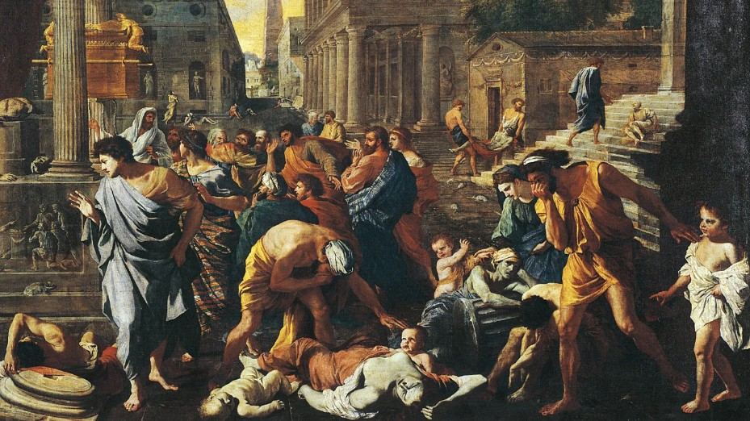
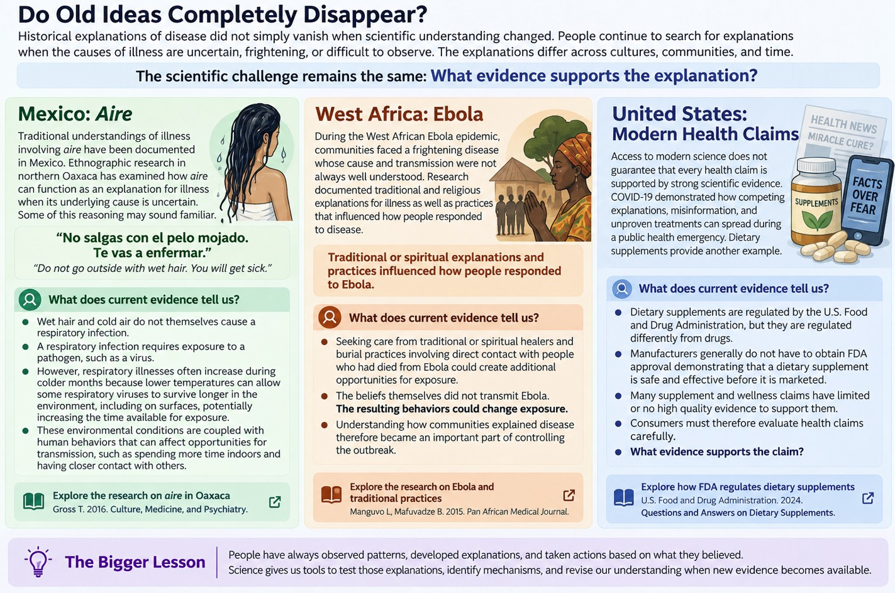
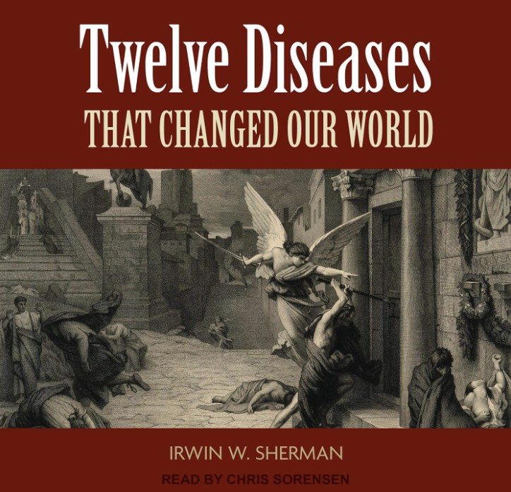
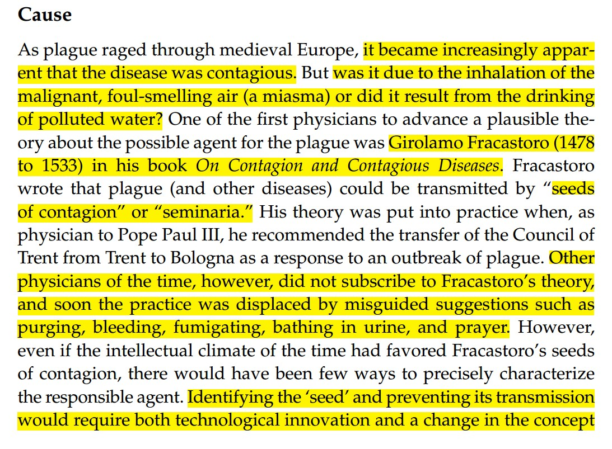
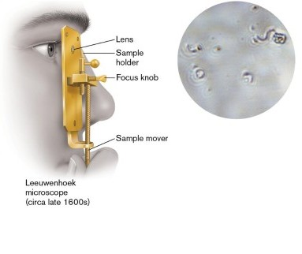
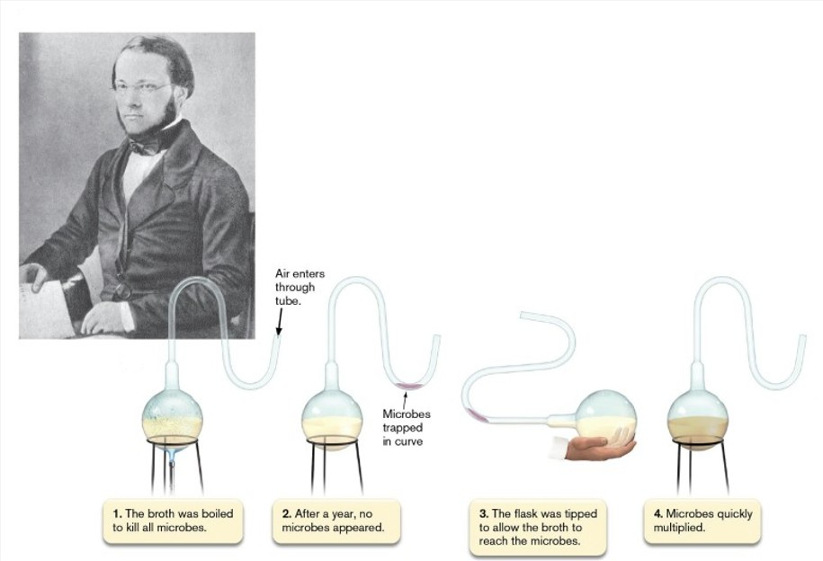
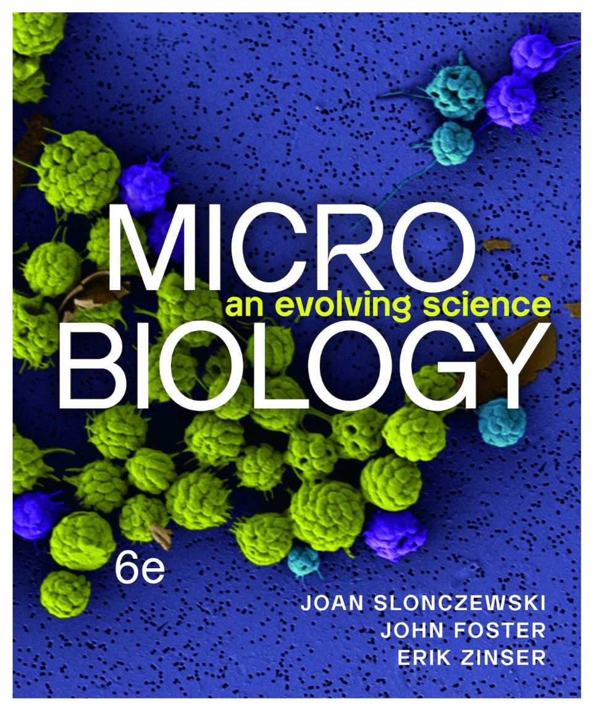

---
format:
  html:
    toc: true
    toc-location: right
    smooth-scroll: true
    code-fold: true
    embed-resources: true
    lightbox: true
  pdf:
    toc: true
    documentclass: scrartcl
    geometry:
      - margin=0.75in
editor: visual
---

```{=html}
<style>

/* =========================================================
   Typography
   ========================================================= */

body {
  color: #212529;
}

blockquote {
  color: #212529;
  font-size: inherit;
  font-style: normal;
  font-weight: normal;
}

blockquote strong {
  color: #212529;
}

.text-center {
  color: #212529;
}


/* =========================================================
   Responsive Mobile Layout
   Stack ALL Quarto columns on narrow screens
   ========================================================= */

@media (max-width: 768px) {

  .columns {
    display: block !important;
  }

  .columns > .column {
    width: 100% !important;
    max-width: 100% !important;
    flex: 0 0 100% !important;
  }

  .columns > .column:empty {
    display: none !important;
  }

  img {
    max-width: 100%;
    height: auto;
  }

  p,
  li,
  figcaption {
    overflow-wrap: anywhere;
  }

}


/* =========================================================
   Poll Everywhere Layout
   Keep instructions left and QR code right
   ========================================================= */

@media (min-width: 501px) {

  .poll-columns {
    display: flex !important;
    align-items: center !important;
  }

  .poll-columns > .column {
    flex: initial !important;
  }

}

</style>
```

:::::: columns
::: {.column width="40%"}
{fig-alt="Exterior view of Notre-Dame Cathedral in Paris, France, showing the Gothic architecture, rose window, flying buttresses, and central spire against a blue sky"}

Construction of Notre-Dame Cathedral began in *1163* and was largely completed during the medieval period. After a major fire on *April 15, 2019*, the cathedral underwent an extensive restoration and reopened in *December 2024*.
:::

::: {.column width="4%"}
:::

::: {.column width="56%"}
## SHM 102: Occupational Health

### Public Health History: Plague

**Lecture 03 · Fall 2026**

Yoni Rodriguez\
Engineering Technologies, Safety, and Construction\
Central Washington University\
[Yoni.Rodriguez\@cwu.edu](mailto:Yoni.Rodriguez@cwu.edu)
:::
::::::

------------------------------------------------------------------------

# The Black Death

{fig-alt="Painting of a city during a plague outbreak, showing sick and dying people in the streets, grieving figures, and classical architecture."}


The Black Death swept through **Europe, western Asia, and Africa from 1346 to 1352**.

It became one of the greatest public health disasters in recorded history.

For more than **500 years**, people could observe the disease and its devastating effects without knowing exactly what caused it or how it spread.

---

# A Mystery That Crossed Continents

The Black Death was one of several major plague pandemics in human history.

Its impact can be understood across both **time** and **geography**.

:::: {.columns}
::: {.column width="58%"}

.](history-infectious-disease.jpg){.lightbox fig-alt="Graph comparing estimated infections and deaths from major infectious disease pandemics, including the Plague of Athens, Plague of Justinian, Black Death, Third Plague Pandemic, H1N1 influenza, HIV/AIDS, 2009 H1N1 influenza, and COVID-19." width="100%"}

:::

::: {.column width="4%"}
:::

::: {.column width="38%"}

::: {style="text-align:center;"}
{.lightbox fig-alt="Google Earth globe showing locations associated with the history and scientific investigation of plague in Western Europe, North Africa, and East Asia." width="85%"}
:::

*Interactive Google Earth project created by Yoni Rodriguez.*

**Want to explore further?**\
[Explore the path of plague in Google Earth](https://earth.google.com/earth/d/1GIR5OAHve5bpCdX06T976v63LRcyeLvr?usp=sharing)

:::
::::

------------------------------------------------------------------------

:::: {.columns .poll-columns}
::: {.column width="65%"}

*What stands out to you?*

Consider both the **scale** of plague and the **distance** separating affected populations.

*How could the same disease appear across such distant places and populations?*

Use Poll Everywhere to share your response.

:::

::: {.column width="5%"}
:::

::: {.column width="30%"}

::: {style="display:flex; justify-content:center; align-items:center; height:100%;"}
{fig-alt="Poll Everywhere QR code and response link for SHM 102" width="250"}
:::

:::
::::

------------------------------------------------------------------------

# What Could People Observe?

:::: {.columns}
::: {.column width="55%"}

People could observe:

- severe illness
- fever
- painful swellings
- dark spots on the skin
- rapid death
- disease appearing in communities
- apparent spread between places and people

They could observe the **outcome**.

They could not yet observe the **cause**.

:::

::: {.column width="5%"}
:::

::: {.column width="40%"}

](cdc-human-plague.jpg){fig-alt="Clinical photograph of a person's hand showing severe dark discoloration and tissue damage affecting several fingers associated with plague."}

:::
::::


## The Buboes

:::: {.columns}
::: {.column width="55%"}

One of the most recognizable signs of plague was the appearance of painful swellings.

These swellings often appeared in the:

- groin
- armpits
- neck

They became known as **buboes**.

For centuries, people could see these swellings.

But observing a symptom did not explain what caused it.

:::

::: {.column width="5%"}
:::

::: {.column width="40%"}

 *The Journal of Lancaster General Hospital*.](bubonic-plague-buboes.jpg){fig-alt="Clinical photograph showing a pronounced swollen lymph node in the neck associated with bubonic plague."}

:::
::::

------------------------------------------------------------------------

# The Central Problem

:::: {.columns .poll-columns}
::: {.column width="65%"}

People could see:

**illness**

**suffering**

**death**

**patterns of spread**

But they could not see what was causing it.

*What Would You Do Next?*

*How would you identify the cause of something you cannot see?*

There is no single correct answer.

Think about:

- what evidence you would collect
- what you would examine
- what tools you might need
- how you would test whether your explanation was correct

Use Poll Everywhere to share your response.

:::

::: {.column width="5%"}
:::

::: {.column width="30%"}

::: {style="display:flex; justify-content:center; align-items:center; height:100%;"}
{fig-alt="Poll Everywhere QR code and response link for SHM 102" width="250"}
:::

:::
::::

------------------------------------------------------------------------

# Competing Explanations

People could observe disease long before they could identify its cause.

Without the ability to see microorganisms, physicians and communities developed different explanations for why people became sick.

Ideas included:

- divine punishment
- imbalance within the body
- environmental conditions
- contaminated water
- poisonous or corrupted air
- contagion between people

Some observations were meaningful.

The challenge was explaining **why** those patterns occurred.

:::: {.columns}
::: {.column width="48%"}

## Imbalance Within the Body

For centuries, European medicine was strongly influenced by the **theory of the four humors**.

Health was thought to depend on maintaining a balance among:

- blood
- yellow bile
- black bile
- phlegm

Illness could therefore be interpreted as an **imbalance within the body**.

Treatments intended to restore balance included bloodletting and purging.

:::

::: {.column width="4%"}
:::

::: {.column width="48%"}

.](the-four-humors.jpg){.lightbox fig-alt="Diagram of the four humors showing blood, yellow bile, black bile, and phlegm and their historical associations with elements, seasons, qualities, and temperaments." width="100%"}

:::
::::

------------------------------------------------------------------------

## What If the Problem Was in the Air?

Another influential explanation associated disease with **miasma**, or corrupted air.

Illness was frequently observed alongside:

- overcrowding
- waste
- decomposition
- stagnant water
- poor sanitation
- unpleasant odors

These observations were not imaginary.

**The environmental conditions were real.**

What remained uncertain was the mechanism connecting those conditions to disease.

:::: {.columns}
::: {.column width="58%"}

During plague outbreaks, people attempted to protect themselves from dangerous air in different ways.

The familiar image of the **plague doctor** reflects this history. Plague doctors stuffed the bird-like beaks with strong-smelling herbs and spices to protect themselves from what they believed spread disease: foul, disease-carrying air known as **miasma**, or "bad air."

People were trying to control an exposure.

They had not yet identified the actual hazard.


:::

::: {.column width="4%"}
:::

::: {.column width="38%"}

 *Heart Views* (2012).](plague-doctor.jpg){fig-alt="Historical illustration of a plague doctor wearing a long coat, broad-brimmed hat, and beaked mask." width="70%"}

:::
::::


## Do Old Ideas Completely Disappear?

Historical explanations of disease did not simply vanish when scientific understanding changed.

People continue to search for explanations when the causes of illness are uncertain, frightening, or difficult to observe.

The explanations differ across cultures, communities, and time.

The scientific challenge remains the same:

### What evidence supports the explanation?

{.lightbox fig-alt="Educational infographic comparing examples from Mexico, West Africa, and the United States. The Mexico example discusses aire and the belief that going outside with wet hair causes illness. The West Africa example examines traditional and religious explanations and practices during the Ebola epidemic. The United States example examines modern health claims and dietary supplement regulation. The infographic emphasizes evaluating explanations using scientific evidence." width="100%"}

**Sources:** [Gross (2016), *Letting the Air Out: Aire as an Empty Signifier in Oaxacan Understandings of Illness*](https://pubmed.ncbi.nlm.nih.gov/27431429/) | [Manguvo & Mafuvadze (2015), *The Impact of Traditional and Religious Practices on the Spread of Ebola in West Africa*](https://pmc.ncbi.nlm.nih.gov/articles/PMC4709130/) | [U.S. Food and Drug Administration, *Questions and Answers on Dietary Supplements*](https://www.fda.gov/food/information-consumers-using-dietary-supplements/questions-and-answers-dietary-supplements)

------------------------------------------------------------------------

## Poll Everywhere

### What explanations for illness or disease have you heard, encountered, or questioned while growing up?

Think about ideas you may have encountered through:

- family or community traditions
- school
- social media
- news or popular culture
- everyday health advice

**What was the explanation, and what evidence would you want before deciding whether it is accurate?**

:::: {.columns .poll-columns}
::: {.column width="65%"}

Submit an example through **Poll Everywhere**.

There is no single correct answer. The goal is to identify an explanation and begin thinking about **how we could test it using evidence**.

:::

::: {.column width="5%"}
:::

::: {.column width="30%"}

::: {style="display:flex; justify-content:center; align-items:center; height:100%;"}
{fig-alt="Poll Everywhere QR code and response link for SHM 102" width="250"}
:::

:::
::::

------------------------------------------------------------------------

## Seeds of Contagion

Not everyone explained disease through bodily imbalance or corrupted air.

As plague spread through medieval Europe, people increasingly recognized that the disease appeared to be **contagious**.

But 

*what was being transmitted?*

*how was it being transmitted?*

In the sixteenth century, Italian physician **Girolamo Fracastoro (1478–1533)** proposed that plague and other diseases could be transmitted by invisible **"seeds of contagion,"** or *seminaria*.

This was a very different hypothesis that asked if disease was transmitted by something physical that people simply could not see? 

:::: {.columns}
::: {.column width="38%"}

{fig-alt="Cover of Irwin W. Sherman's book Twelve Diseases That Changed Our World." width="85%"}

:::

::: {.column width="4%"}
:::

::: {.column width="58%"}

{.lightbox fig-alt="Excerpt from Sherman's Bubonic Plague chapter describing miasma, polluted water, Girolamo Fracastoro, and the theory that plague could be transmitted by seeds of contagion or seminaria." width="100%"}

:::
::::

**Source:** Sherman, I. W. (2007). "Bubonic Plague." In *Twelve Diseases That Changed Our World* (pp. 68–82). ASM Press. [https://doi.org/10.1128/9781555816346.ch5](https://doi.org/10.1128/9781555816346.ch5)

### However, the hypothesis was not enough.

### Even if Fracastoro was correct, people still lacked the technology needed to identify the responsible agent.


# The Microscope

In the seventeenth century, improvements in microscopy allowed scientists
to observe structures and organisms that had previously been invisible.

:::: {.columns}
::: {.column width="52%"}

**Robert Hooke (1635–1703)** used a compound microscope to examine
biological materials and published his observations in *Micrographia*
in 1665.

Hooke observed microscopic structures and organisms, including mold,
but his microscopes were not powerful enough to reveal individual
bacteria.

**Antonie van Leeuwenhoek (1632–1723)** developed powerful single-lens
microscopes and became the first person known to observe single-celled
microorganisms, eventually including bacteria.

### Humans could finally see microorganisms.

### However, nearly two centuries passed before scientists established the connection between microorganisms and disease.

:::

::: {.column width="4%"}
:::

::: {.column width="44%"}

{.lightbox fig-alt="Robert Hooke's 1665 drawing of mold sporangia observed using a compound microscope." width="70%"}

{.lightbox fig-alt="Diagram of Antonie van Leeuwenhoek's single-lens microscope beside a microscopic field obtained using a replica of the instrument." width="75%"}

:::
::::


## Poll Everywhere

### Why do you think it took so long for humans to connect microbes with infectious disease?

There is no single answer.

Think about what scientists could **observe**, what they could **measure**, and what evidence they would need to demonstrate that a microorganism actually caused disease.

:::: {.columns .poll-columns}
::: {.column width="65%"}

Submit your explanation through **Poll Everywhere**.

Consider the problem scientists faced:

**Seeing a microorganism does not necessarily mean that it caused the disease.**

What additional evidence would you want?

:::

::: {.column width="5%"}
:::

::: {.column width="30%"}

::: {style="display:flex; justify-content:center; align-items:center; height:100%;"}
{fig-alt="Poll Everywhere QR code and response link for SHM 102" width="250"}
:::

:::
::::

------------------------------------------------------------------------

# Louis Pasteur

Remember where this lecture began?

**France.**

French chemist **Louis Pasteur (1822–1895)** investigated microorganisms
while studying problems involving fermentation for the French Beer & Wine Industry.

His research demonstrated that yeast, a single-celled fungus, in the absence of oxygen
produced alcohol as a terminal waste product. 

:::: {.columns}
::: {.column width="45%"}

In his famous **swan-neck flask experiments**, air could enter a
sterilized flask of beef broth, while dust and microorganisms were trapped
in the curved neck.

The broth remained free of microbial growth for many years.

When a flask was tilted so that the broth contacted material trapped in
the neck, microorganisms grew.

**The air was present.**

**Microbial growth was not.**

:::

::: {.column width="5%"}
:::

::: {.column width="50%"}

{.lightbox fig-alt="Portrait of Louis Pasteur beside a diagram of his swan-neck flask experiment showing sterilization of broth, microbes trapped in the curved neck, and microbial growth after broth contacts the trapped material." width="100%"}

:::
::::

This represented more than simply observing microorganisms.

Scientists could use **controlled experiments to test competing explanations**.

1. *Make an observation*
2. *Ask a question*
3. *Form a hypothesis*
4. *Conduct an experiment*
5. *Evaluate the evidence*


## Germ Theory

Microscopy made microorganisms visible.

Experimental science made it possible to investigate what microorganisms
were doing.

During the nineteenth century, evidence from scientists including
**Louis Pasteur** and **Robert Koch** helped establish the **germ theory
of disease**.

The central idea was revolutionary:

### Many infectious diseases are caused by microorganisms.

Pasteur's experiments demonstrated that microorganisms did not "simply
appear" through what was considered spontaneous generation.

Koch later developed methods for studying microorganisms in isolation
and establishing causal relationships between specific microorganisms
and specific diseases.

Scientists now had:

**a scientific framework**

**experimental methods**

**technologies for observing microorganisms**

Together, these developments changed the questions scientists could ask.

**Germ theory:** the theory that many infectious diseases are caused by
microorganisms.

### Source

:::: {.columns}
::: {.column width="22%"}

{fig-alt="Cover of the sixth edition of Microbiology: An Evolving Science by Joan Slonczewski, John W. Foster, and Erik R. Zinser." width="75%"}

:::

::: {.column width="4%"}
:::

::: {.column width="74%"}

The history of microscopy, Robert Hooke, Antonie van Leeuwenhoek, and
Louis Pasteur:

**Slonczewski, J., Foster, J. W., & Zinser, E. R. (2024).**  
*Microbiology: An Evolving Science* (6th ed.). W. W. Norton & Company.

[Explore *Microbiology: An Evolving Science* →](https://wwnorton.com/books/9781324033523)

:::
::::


------------------------------------------------------------------------

# 1894: Plague in Hong Kong

During the nineteenth century, plague again spread from China.

Modern transportation helped the disease move across large distances.

By **1894**, a major plague epidemic had reached **Hong Kong**.

:::: {.columns}
::: {.column width="48%"}

Scientists now had scientific tools and frameworks their medieval
predecessors did not:

- germ theory
- improved microscopes
- staining techniques
- experimental methods

For centuries, people had observed the symptoms and patterns of plague
without being able to identify its cause.

Now scientists could apply these innovations to investigate the disease.

The question was no longer simply:

### What is happening?

It became:

### What organism is causing this disease?

:::

::: {.column width="4%"}
:::

::: {.column width="48%"}

{.lightbox fig-alt="Historical black-and-white photograph of the men's ward at the Kennedy Town Glassworks emergency plague hospital in Hong Kong during the 1894 plague epidemic, with patients lying on bedding along both sides of a long hospital ward." width="100%"}

:::
::::

**Source:** Echenberg, M. (2007). "An Unexampled Calamity: Hong Kong, 1894." In *Plague Ports: The Global Urban Impact of Bubonic Plague, 1894–1901* (pp. 16–46). NYU Press. [Access through JSTOR →](http://www.jstor.org.offcampus.lib.washington.edu/stable/j.ctt9qgb84.7)

------------------------------------------------------------------------

# Alexandre Yersin

**Alexandre Yersin**, a bacteriologist associated with the Pasteur Institute, traveled to Hong Kong to investigate the epidemic.

His task was to identify the organism responsible for plague.

But first he needed a specimen.

------------------------------------------------------------------------

## The Bubo Becomes Evidence

Yersin obtained access to the body of a person who had recently died from plague.

Using a sterile needle, he collected fluid from a **bubo**.

Think about the progression.

A swelling that physicians had observed for centuries was no longer only a symptom.

It became a source of biological evidence.

------------------------------------------------------------------------

## Under the Microscope

Yersin examined the bubo fluid under a microscope.

He found it filled with bacteria.

The bacteria stained poorly with Gram stain.

They were **Gram negative**.

Now there was a candidate organism.

But seeing bacteria in a sick person did not automatically prove that the bacteria caused plague.

------------------------------------------------------------------------

## How Could He Test the Idea?

Yersin used some of the material from the bubo to inoculate guinea pigs.

The guinea pigs died.

When he examined them, he found the same bacteria.

The evidence was becoming stronger.

**Sick human**

↓

**Bacteria in bubo**

↓

**Experimental animal exposed**

↓

**Animal develops fatal disease**

↓

**Same bacteria recovered**

------------------------------------------------------------------------

## The Dead Rats

Yersin noticed something else.

There were large numbers of dead rats:

- in the streets
- in hospital corridors
- around the morgue

He examined some of the rats.

### He found the same bacteria.

------------------------------------------------------------------------

## One Organism, Two Hosts

Yersin now had evidence connecting the organism with:

**Humans**

and

**Rats**

The bacterium responsible for plague would eventually be named:

### *Yersinia pestis*

in recognition of Alexandre Yersin.

------------------------------------------------------------------------

# What Had Yersin Solved?

Yersin had answered an enormous question.

### What causes plague?

**A bacterium: *Yersinia pestis*.**

But another question remained unanswered.

### How was the bacterium moving between rats and humans?

Knowing the **hazard** did not automatically reveal the **exposure pathway**.

------------------------------------------------------------------------

# Understanding the Disease

Now that we know the agent, we can better understand what happens after infection.

*Yersinia pestis* can produce different forms of plague depending on where infection develops.

------------------------------------------------------------------------

## Bubonic Plague

The most familiar form is **bubonic plague**.

The bacteria reach the lymphatic system and multiply in regional lymph nodes.

This produces the characteristic swollen lymph nodes:

### buboes

Common locations include:

- groin
- armpits
- neck

------------------------------------------------------------------------

## Septicemic Plague

Sometimes the bacteria enter and multiply in the bloodstream.

This is **septicemic plague**.

The infection can produce:

- fever
- chills
- severe systemic illness
- hemorrhaging
- tissue damage

Buboes may not always develop.

------------------------------------------------------------------------

## Pneumonic Plague

If the lungs become infected, the disease can become **pneumonic plague**.

This changes something extremely important.

The bacteria can now leave an infected person through respiratory droplets.

That creates the possibility of:

**human → human transmission**

------------------------------------------------------------------------

## Same Agent, Different Forms of Disease

The organism has not changed.

### *Yersinia pestis*

But where infection develops in the body can affect the clinical form of disease.

**Lymphatic system**

→ bubonic plague

**Bloodstream**

→ septicemic plague

**Lungs**

→ pneumonic plague

Understanding the form of disease can also help us understand how transmission may occur.

------------------------------------------------------------------------

# The Missing Link

Yersin had connected plague with rats.

But rats alone did not explain transmission.

Another investigator would take the next major step.

------------------------------------------------------------------------

# Paul Louis Simond

French physician **Paul Louis Simond** investigated plague after Yersin.

He noticed an important occupational pattern.

Workers who had contact with dead rats became ill.

Workers without that contact did not.

That observation suggested an exposure relationship.

------------------------------------------------------------------------

## Look at the Task

Consider the workers.

The important question was not simply:

### What was their job title?

The important question was:

### What were they actually doing?

Some workers were cleaning floors containing dead rats.

Their work created an opportunity for exposure.

------------------------------------------------------------------------

## Another Observation

Simond noticed something about the rats.

Healthy rats groomed themselves and tended to have relatively few fleas.

Sick rats could no longer groom effectively.

They carried many fleas.

Then the rats died.

### What happened to the fleas?

------------------------------------------------------------------------

## A Hypothesis

Simond proposed that an intermediary might connect infected rats with humans.

Perhaps the rat itself was not directly transmitting the disease.

Perhaps the intermediary was a:

### flea

------------------------------------------------------------------------

# Testing the Hypothesis

Simond designed an experiment.

A plague-infected rat was placed below a healthy rat.

The healthy rat was separated from the infected rat so the animals could not directly touch.

But fleas could move between them.

The healthy rat developed plague.

------------------------------------------------------------------------

## The Control

Simond also tested what happened when fleas were absent.

Without fleas, healthy rats exposed to the experimental conditions did not develop plague.

When fleas were introduced:

### plague appeared.

The transmission pathway was becoming clear.

------------------------------------------------------------------------

# The Transmission Pathway

## Rodent → Flea → Human

An infected rodent carries *Yersinia pestis*.

↓

A flea feeds on the infected rodent.

↓

The flea acquires the bacteria.

↓

The infected rodent becomes sick and may die.

↓

The flea leaves the dead or dying host.

↓

The flea seeks another blood meal.

↓

The flea bites another animal or a human.

↓

*Yersinia pestis* enters the new host.

------------------------------------------------------------------------

# Agent, Reservoir, Vector, Host

We can now give names to the pieces of the system.

### Agent

*Yersinia pestis*

### Reservoir

Rodent populations

### Vector

Fleas

### Host

Humans and other susceptible mammals

These terms help us organize how infectious hazards move through an environment.

------------------------------------------------------------------------

# From Microbiology to Occupational Health

Now consider plague as an occupational health problem.

### Who might encounter this exposure pathway because of their work?

Possible occupational groups include:

- veterinarians
- veterinary technicians
- animal control workers
- wildlife biologists
- laboratory workers
- agricultural workers
- pest control workers
- workers handling animal carcasses

The occupational hazard is not determined by the job title alone.

It depends on the **task and opportunity for exposure**.

------------------------------------------------------------------------

## Think Like an Exposure Scientist

For any biological hazard, ask:

### What is the agent?

### Where is the reservoir?

### How does it leave the reservoir?

### How does it move through the environment?

### How does it reach the worker?

### What route allows it to enter the body?

------------------------------------------------------------------------

# Plague Did Not Disappear

Plague is not only a medieval disease.

*Yersinia pestis* continues to circulate in animal populations.

Human cases still occur.

The ecological system that supports plague still exists.

------------------------------------------------------------------------

## Plague in the United States

In the United States, plague persists primarily in wildlife populations in western states.

Potential reservoirs include wild rodents.

Human exposure can occur when people enter environments where infected animals and fleas are present.

This means plague remains relevant to:

- wildlife work
- veterinary work
- outdoor work
- animal handling
- public health surveillance

------------------------------------------------------------------------

## Recognition Matters

Modern plague is uncommon.

That creates another problem.

### What happens when a disease is rare enough that workers or clinicians do not immediately recognize it?

Delayed recognition can delay:

- diagnosis
- treatment
- exposure investigation
- protective measures

A known hazard can still cause serious disease when the exposure pathway is overlooked.

------------------------------------------------------------------------

# Breaking the Chain

Once we understand the pathway, we can identify places where intervention is possible.

**Reservoir**

↓

**Vector**

↓

**Environment / task**

↓

**Worker**

↓

**Route of entry**

Controls can interrupt the chain at more than one point.

------------------------------------------------------------------------

# Discussion

A worker finds several dead rodents around a worksite.

### What questions would you ask before deciding whether workers are at risk?

Think about:

- the agent
- reservoir
- vector
- worker tasks
- exposure pathways
- routes of entry
- possible controls

------------------------------------------------------------------------

# From 1347 to Today

Consider how our understanding changed.

**1347**

People observe disease but cannot identify the cause.

↓

**Seeds of contagion**

Invisible agents are proposed.

↓

**Microscope**

The microbial world becomes visible.

↓

**Germ theory**

Specific microorganisms can cause specific diseases.

↓

**1894: Yersin**

The bacterium responsible for plague is identified.

↓

**1898: Simond**

Flea-mediated transmission is demonstrated.

↓

**Today**

We understand the agent, reservoirs, vectors, exposure pathways, disease mechanisms, and opportunities for prevention.

------------------------------------------------------------------------

# Key Takeaway

The disease existed before we understood it.

The exposure pathway existed before we understood it.

The hazard did not suddenly appear when scientists identified it.

### Our ability to observe, measure, and explain it changed.

In occupational health, identifying the hazard is only the beginning.

We also need to understand:

**where it comes from**

↓

**how it moves**

↓

**who encounters it**

↓

**how exposure occurs**

↓

**what happens after exposure**

↓

**where we can intervene**

Plague provides a historical example of how observation, technology, microbiology, epidemiology, and exposure science came together to reveal an occupational and public health hazard.

------------------------------------------------------------------------

# Key Terms

| Term | Definition |
|------------------------------------|------------------------------------|
| **Bubo** | A painful, swollen lymph node associated with bubonic plague. |
| **Bubonic plague** | A form of plague characterized by infection of the lymphatic system and the development of swollen lymph nodes called buboes. |
| **Septicemic plague** | A form of plague in which *Yersinia pestis* infects the bloodstream. |
| **Pneumonic plague** | A form of plague involving the lungs that can allow respiratory transmission between people. |
| **Germ theory** | The scientific concept that microorganisms can cause disease. |
| **Pathogen** | A biological agent capable of causing disease. |
| **Host** | An organism that can become infected by a pathogen. |
| **Reservoir** | A population, organism, or environmental source in which a pathogen normally lives and persists. |
| **Vector** | A living organism that carries and transmits a pathogen between hosts. |
| **Transmission route** | The way a pathogen moves from its source or reservoir to a susceptible host. |
| **Vector borne transmission** | Transmission of a pathogen through a living vector. |
| ***Yersinia pestis*** | The bacterium that causes plague. |

------------------------------------------------------------------------

## Make your flashcards

### Copy → Paste → Study

Copy the terms below to make your own **Anki or Quizlet** flashcards.

**Anki:** Save as a `.txt` file → Import → Select **Semicolon** as the field separator.

``` text
Bubo;A painful, swollen lymph node associated with bubonic plague.
Bubonic plague;A form of plague characterized by infection of the lymphatic system and the development of swollen lymph nodes called buboes.
Septicemic plague;A form of plague in which Yersinia pestis infects the bloodstream.
Pneumonic plague;A form of plague involving the lungs that can allow respiratory transmission between people.
Germ theory;The scientific concept that microorganisms can cause disease.
Pathogen;A biological agent capable of causing disease.
Host;An organism that can become infected by a pathogen.
Reservoir;A population, organism, or environmental source in which a pathogen normally lives and persists.
Vector;A living organism that carries and transmits a pathogen between hosts.
Transmission route;The way a pathogen moves from its source or reservoir to a susceptible host.
Vector borne transmission;Transmission of a pathogen through a living vector.
Yersinia pestis;The bacterium that causes plague.
```

### Copyright & Use

**SHM 102: Occupational Health**\
© 2026 Yoni Rodriguez

Except where otherwise noted, original course materials are licensed under the Creative Commons Attribution-NonCommercial 4.0 International License (CC BY-NC 4.0).

Third-party materials remain subject to their respective copyright and licensing terms.
