---
format:
  html:
    toc: true
    toc-location: right
    smooth-scroll: true
    code-fold: true
    embed-resources: true
    lightbox: true
  pdf:
    toc: true
    documentclass: scrartcl
    geometry:
      - margin=0.75in
editor: visual
---

```{=html}
<style>

/* =========================================================
   Typography
   ========================================================= */

body {
  color: #212529;
}

blockquote {
  color: #212529;
  font-size: inherit;
  font-style: normal;
  font-weight: normal;
}

blockquote strong {
  color: #212529;
}

.text-center {
  color: #212529;
}


/* =========================================================
   Responsive Mobile Layout
   Stack ALL Quarto columns on narrow screens
   ========================================================= */

@media (max-width: 768px) {

  .columns {
    display: block !important;
  }

  .columns > .column {
    width: 100% !important;
    max-width: 100% !important;
    flex: 0 0 100% !important;
  }

  .columns > .column:empty {
    display: none !important;
  }

  img {
    max-width: 100%;
    height: auto;
  }

  p,
  li,
  figcaption {
    overflow-wrap: anywhere;
  }

}


/* =========================================================
   Poll Everywhere Layout
   Keep instructions left and QR code right
   ========================================================= */

@media (min-width: 501px) {

  .poll-columns {
    display: flex !important;
    align-items: center !important;
  }

  .poll-columns > .column {
    flex: initial !important;
  }

}

</style>
```

:::::: columns
::: {.column width="40%"}
{fig-alt="Exterior view of Notre-Dame Cathedral in Paris, France, showing the Gothic architecture, rose window, flying buttresses, and central spire against a blue sky"}

Construction of Notre-Dame Cathedral began in *1163* and was largely completed during the medieval period. After a major fire on *April 15, 2019*, the cathedral underwent an extensive restoration and reopened in *December 2024*.
:::

::: {.column width="4%"}
:::

::: {.column width="56%"}
## SHM 102: Occupational Health

### Public Health History: Plague

**Lecture 03 · Fall 2026**

Yoni Rodriguez\
Engineering Technologies, Safety, and Construction\
Central Washington University\
[Yoni.Rodriguez\@cwu.edu](mailto:Yoni.Rodriguez@cwu.edu)
:::
::::::

------------------------------------------------------------------------

# The Black Death

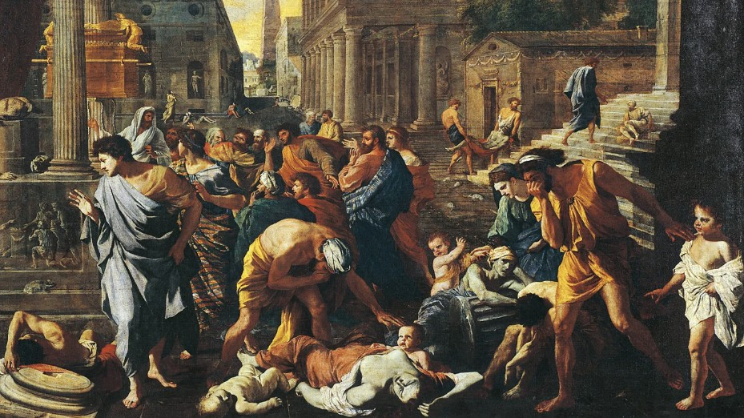{fig-alt="Painting of a city during a plague outbreak, showing sick and dying people in the streets, grieving figures, and classical architecture."}

The Black Death swept through **Europe, western Asia, and Africa from 1346 to 1352**.

It became one of the greatest public health disasters in recorded history.

For more than **500 years**, people could observe the disease and its devastating effects without knowing exactly what caused it or how it spread.

------------------------------------------------------------------------

# A Mystery That Crossed Continents

The Black Death was one of several major plague pandemics in human history.

Its impact can be understood across both **time** and **geography**.

::::::: columns
::: {.column width="58%"}
.](history-infectious-disease.jpg){.lightbox fig-alt="Graph comparing estimated infections and deaths from major infectious disease pandemics, including the Plague of Athens, Plague of Justinian, Black Death, Third Plague Pandemic, H1N1 influenza, HIV/AIDS, 2009 H1N1 influenza, and COVID-19." width="100%"}
:::

::: {.column width="4%"}
:::

:::: {.column width="38%"}
::: {style="text-align:center;"}
{.lightbox fig-alt="Google Earth globe showing locations associated with the history and scientific investigation of plague in Western Europe, North Africa, and East Asia." width="85%"}
:::

*Interactive Google Earth project created by Yoni Rodriguez.*

**Want to explore further?**\
[Explore the path of plague in Google Earth](https://earth.google.com/earth/d/1GIR5OAHve5bpCdX06T976v63LRcyeLvr?usp=sharing)
::::
:::::::

------------------------------------------------------------------------

::::::: {.columns .poll-columns}
::: {.column width="65%"}
*What stands out to you?*

Consider both the **scale** of plague and the **distance** separating affected populations.

*How could the same disease appear across such distant places and populations?*

Use Poll Everywhere to share your response.
:::

::: {.column width="5%"}
:::

:::: {.column width="30%"}
::: {style="display:flex; justify-content:center; align-items:center; height:100%;"}
{fig-alt="Poll Everywhere QR code and response link for SHM 102" width="250"}
:::
::::
:::::::

------------------------------------------------------------------------

# What Could People Observe?

:::::: columns
::: {.column width="55%"}
People could observe:

- severe illness
- fever
- painful swellings
- dark spots on the skin
- rapid death
- disease appearing in communities
- apparent spread between places and people

They could observe the **outcome**.

They could not yet observe the **cause**.
:::

::: {.column width="5%"}
:::

::: {.column width="40%"}
](cdc-human-plague.jpg){fig-alt="Clinical photograph of a person's hand showing severe dark discoloration and tissue damage affecting several fingers associated with plague."}
:::
::::::

## The Buboes

:::::: columns
::: {.column width="55%"}
One of the most recognizable signs of plague was the appearance of painful swellings.

These swellings often appeared in the:

- groin
- armpits
- neck

They became known as **buboes**.

For centuries, people could see these swellings.

But observing a symptom did not explain what caused it.
:::

::: {.column width="5%"}
:::

::: {.column width="40%"}
 *The Journal of Lancaster General Hospital*.](bubonic-plague-buboes.jpg){fig-alt="Clinical photograph showing a pronounced swollen lymph node in the neck associated with bubonic plague."}
:::
::::::

------------------------------------------------------------------------

# The Central Problem

::::::: {.columns .poll-columns}
::: {.column width="65%"}
People could see:

**illness**

**suffering**

**death**

**patterns of spread**

But they could not see what was causing it.

*What Would You Do Next?*

*How would you identify the cause of something you cannot see?*

There is no single correct answer.

Think about:

- what evidence you would collect
- what you would examine
- what tools you might need
- how you would test whether your explanation was correct

Use Poll Everywhere to share your response.
:::

::: {.column width="5%"}
:::

:::: {.column width="30%"}
::: {style="display:flex; justify-content:center; align-items:center; height:100%;"}
{fig-alt="Poll Everywhere QR code and response link for SHM 102" width="250"}
:::
::::
:::::::

------------------------------------------------------------------------

# Competing Explanations

People could observe disease long before they could identify its cause.

Without the ability to see microorganisms, physicians and communities developed different explanations for why people became sick.

Ideas included:

- divine punishment
- imbalance within the body
- environmental conditions
- contaminated water
- poisonous or corrupted air
- contagion between people

Some observations were meaningful.

The challenge was explaining **why** those patterns occurred.

:::::: columns
::: {.column width="48%"}
## Imbalance Within the Body

For centuries, European medicine was strongly influenced by the **theory of the four humors**.

Health was thought to depend on maintaining a balance among:

- blood
- yellow bile
- black bile
- phlegm

Illness could therefore be interpreted as an **imbalance within the body**.

Treatments intended to restore balance included bloodletting and purging.
:::

::: {.column width="4%"}
:::

::: {.column width="48%"}
.](the-four-humors.jpg){.lightbox fig-alt="Diagram of the four humors showing blood, yellow bile, black bile, and phlegm and their historical associations with elements, seasons, qualities, and temperaments." width="100%"}
:::
::::::

------------------------------------------------------------------------

## What If the Problem Was in the Air?

Another influential explanation associated disease with **miasma**, or corrupted air.

Illness was frequently observed alongside:

- overcrowding
- waste
- decomposition
- stagnant water
- poor sanitation
- unpleasant odors

These observations were not imaginary.

**The environmental conditions were real.**

What remained uncertain was the mechanism connecting those conditions to disease.

:::::: columns
::: {.column width="58%"}
During plague outbreaks, people attempted to protect themselves from dangerous air in different ways.

The familiar image of the **plague doctor** reflects this history. Plague doctors stuffed the bird-like beaks with strong-smelling herbs and spices to protect themselves from what they believed spread disease: foul, disease-carrying air known as **miasma**, or "bad air."

People were trying to control an exposure.

They had not yet identified the actual hazard.
:::

::: {.column width="4%"}
:::

::: {.column width="38%"}
 *Heart Views* (2012).](plague-doctor.jpg){fig-alt="Historical illustration of a plague doctor wearing a long coat, broad-brimmed hat, and beaked mask." width="70%"}
:::
::::::

## Do Old Ideas Completely Disappear?

Historical explanations of disease did not simply vanish when scientific understanding changed.

People continue to search for explanations when the causes of illness are uncertain, frightening, or difficult to observe.

The explanations differ across cultures, communities, and time.

The scientific challenge remains the same:

### What evidence supports the explanation?

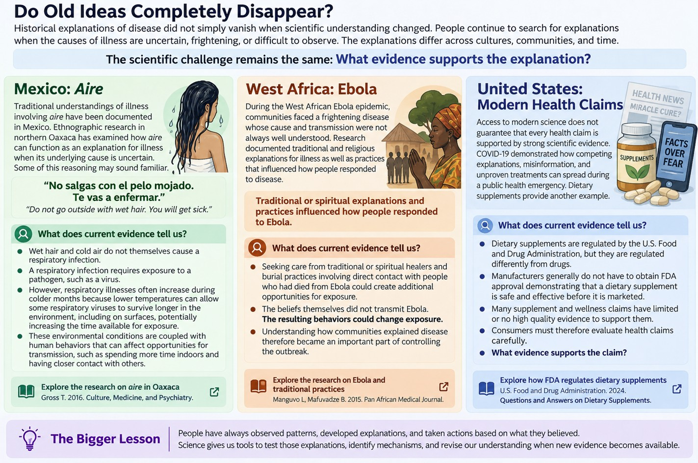{.lightbox fig-alt="Educational infographic comparing examples from Mexico, West Africa, and the United States. The Mexico example discusses aire and the belief that going outside with wet hair causes illness. The West Africa example examines traditional and religious explanations and practices during the Ebola epidemic. The United States example examines modern health claims and dietary supplement regulation. The infographic emphasizes evaluating explanations using scientific evidence." width="100%"}

**Sources:** [Gross (2016), *Letting the Air Out: Aire as an Empty Signifier in Oaxacan Understandings of Illness*](https://pubmed.ncbi.nlm.nih.gov/27431429/) \| [Manguvo & Mafuvadze (2015), *The Impact of Traditional and Religious Practices on the Spread of Ebola in West Africa*](https://pmc.ncbi.nlm.nih.gov/articles/PMC4709130/) \| [U.S. Food and Drug Administration, *Questions and Answers on Dietary Supplements*](https://www.fda.gov/food/information-consumers-using-dietary-supplements/questions-and-answers-dietary-supplements)

------------------------------------------------------------------------

## Poll Everywhere

### What explanations for illness or disease have you heard, encountered, or questioned while growing up?

Think about ideas you may have encountered through:

- family or community traditions
- school
- social media
- news or popular culture
- everyday health advice

**What was the explanation, and what evidence would you want before deciding whether it is accurate?**

::::::: {.columns .poll-columns}
::: {.column width="65%"}
Submit an example through **Poll Everywhere**.

There is no single correct answer. The goal is to identify an explanation and begin thinking about **how we could test it using evidence**.
:::

::: {.column width="5%"}
:::

:::: {.column width="30%"}
::: {style="display:flex; justify-content:center; align-items:center; height:100%;"}
{fig-alt="Poll Everywhere QR code and response link for SHM 102" width="250"}
:::
::::
:::::::

------------------------------------------------------------------------

## Seeds of Contagion

Not everyone explained disease through bodily imbalance or corrupted air.

As plague spread through medieval Europe, people increasingly recognized that the disease appeared to be **contagious**.

::: {.callout-note title="The Unanswered Questions"}
**What was being transmitted?**

**How was it being transmitted?**
:::

In the sixteenth century, Italian physician **Girolamo Fracastoro "Giro" (1478–1533)** proposed that plague and other diseases could be transmitted by invisible **"seeds of contagion,"** or *seminaria*.

This was a very different hypothesis that asked whether disease was transmitted by something physical that people simply could not see.

:::: {.columns}
::: {.column width="38%"}

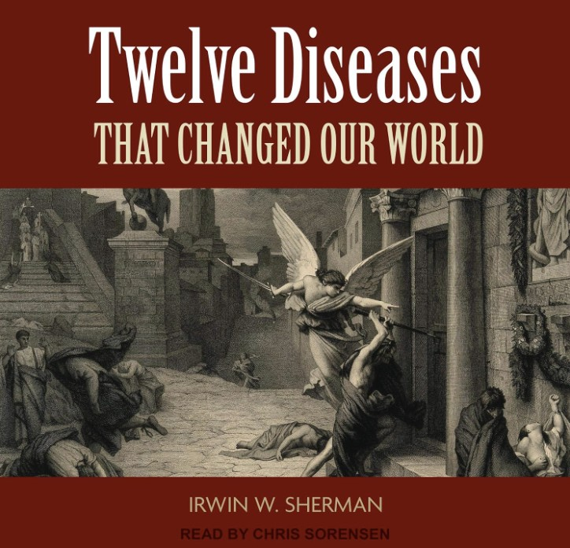{fig-alt="Cover of Irwin W. Sherman's book Twelve Diseases That Changed Our World." width="85%"}

:::

::: {.column width="4%"}
:::

::: {.column width="58%"}

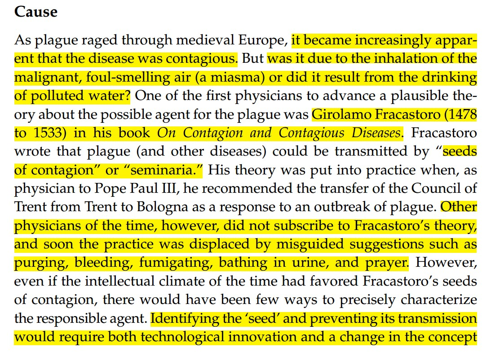{.lightbox fig-alt="Excerpt from Sherman's Bubonic Plague chapter describing miasma, polluted water, Girolamo Fracastoro, and the theory that plague could be transmitted by seeds of contagion or seminaria." width="100%"}

:::
::::

**Source:** Sherman, I. W. (2007). "Bubonic Plague." In *Twelve Diseases That Changed Our World* (pp. 68–82). ASM Press. <https://doi.org/10.1128/9781555816346.ch5>

------------------------------------------------------------------------

::: {.callout-important title="A Hypothesis Was Not Enough"}
**Giro** had proposed something that could not yet be directly observed.

Even if **Giro** was correct, people still lacked the technology needed to identify the responsible agent.
:::

------------------------------------------------------------------------

# The Microscope

In the seventeenth century, improvements in microscopy allowed scientists to observe structures and organisms that had previously been invisible.

:::: {.columns}
::: {.column width="52%"}

**Robert Hooke (1635–1703)** used a compound microscope to examine biological materials and published his observations in *Micrographia* in 1665.

Hooke observed microscopic structures and organisms, including mold, but his microscopes were not powerful enough to reveal individual bacteria.

**Antonie van Leeuwenhoek (1632–1723)** developed powerful single-lens microscopes and became the first person known to observe single-celled microorganisms, eventually including bacteria.

::: {.callout-important title="Seeing Was Not the Same as Understanding"}
**Humans could finally see microorganisms.**

**However, nearly two centuries passed before scientists established the connection between microorganisms and disease.**
:::

:::

::: {.column width="4%"}
:::

::: {.column width="44%"}

{.lightbox fig-alt="Robert Hooke's 1665 drawing of mold sporangia observed using a compound microscope." width="70%"}

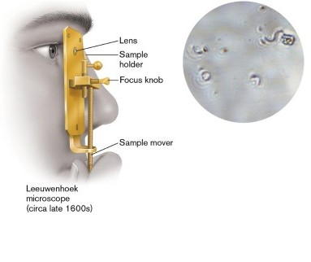{.lightbox fig-alt="Diagram of Antonie van Leeuwenhoek's single-lens microscope beside a microscopic field obtained using a replica of the instrument." width="75%"}

:::
::::

------------------------------------------------------------------------

## Poll Everywhere

### Why do you think it took so long for humans to connect microbes with infectious disease?

There is no single answer.

Think about what scientists could **observe**, what they could **measure**, and what evidence they would need to demonstrate that a microorganism actually caused disease.

::::::: {.columns .poll-columns}
::: {.column width="65%"}
Submit your explanation through **Poll Everywhere**.

Consider the problem scientists faced:

**Seeing a microorganism does not necessarily mean that it caused the disease.**

What additional evidence would you want?
:::

::: {.column width="5%"}
:::

:::: {.column width="30%"}
::: {style="display:flex; justify-content:center; align-items:center; height:100%;"}
{fig-alt="Poll Everywhere QR code and response link for SHM 102" width="250"}
:::
::::
:::::::

------------------------------------------------------------------------

# Louis Pasteur

Remember where this lecture began?

**France.**

French chemist **Louis Pasteur (1822–1895)** investigated microorganisms while studying problems involving fermentation for the French Beer & Wine Industry.

His research demonstrated that yeast, a single-celled fungus, in the absence of oxygen produced alcohol as a terminal waste product.

:::: {.columns}
::: {.column width="45%"}

In his famous **swan-neck flask experiments**, air could enter a sterilized flask of beef broth, while dust and microorganisms were trapped in the curved neck.

The broth remained free of microbial growth for many years.

When a flask was tilted so that the broth contacted material trapped in the neck, microorganisms grew.

**The air was present.**

**Microbial growth was not.**

:::

::: {.column width="5%"}
:::

::: {.column width="50%"}

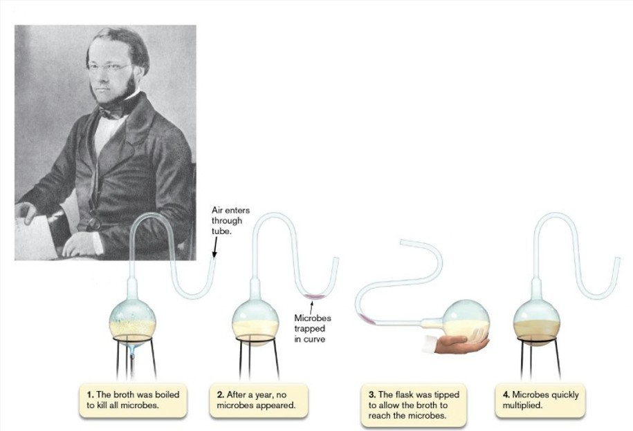{.lightbox fig-alt="Portrait of Louis Pasteur beside a diagram of his swan-neck flask experiment showing sterilization of broth, microbes trapped in the curved neck, and microbial growth after broth contacts the trapped material." width="100%"}

:::
::::

::: {.callout-tip title="From Observation to Experiment"}
This represented more than simply observing microorganisms.

Scientists could use **controlled experiments to test competing explanations**.

1. *Make an observation*
2. *Ask a question*
3. *Form a hypothesis*
4. *Conduct an experiment*
5. *Evaluate the evidence*
:::

## Germ Theory

Microscopy made microorganisms visible.

Experimental science made it possible to investigate what microorganisms were doing.

During the nineteenth century, evidence from scientists including **Louis Pasteur** and **Robert Koch** helped establish the **germ theory of disease**.

The central idea was revolutionary:

### Many infectious diseases are caused by microorganisms.

Pasteur's experiments demonstrated that microorganisms did not "simply appear" through what was considered spontaneous generation.

Koch later developed methods for studying microorganisms in isolation and establishing causal relationships between specific microorganisms and specific diseases.

::: {.callout-tip title="A New Scientific Framework"}
Scientists now had:

- **a scientific framework**
- **experimental methods**
- **technologies for observing microorganisms**

Together, these developments changed the questions scientists could ask.

**Germ theory:** the theory that many infectious diseases are caused by microorganisms.
:::

### Source

:::::: columns
::: {.column width="22%"}
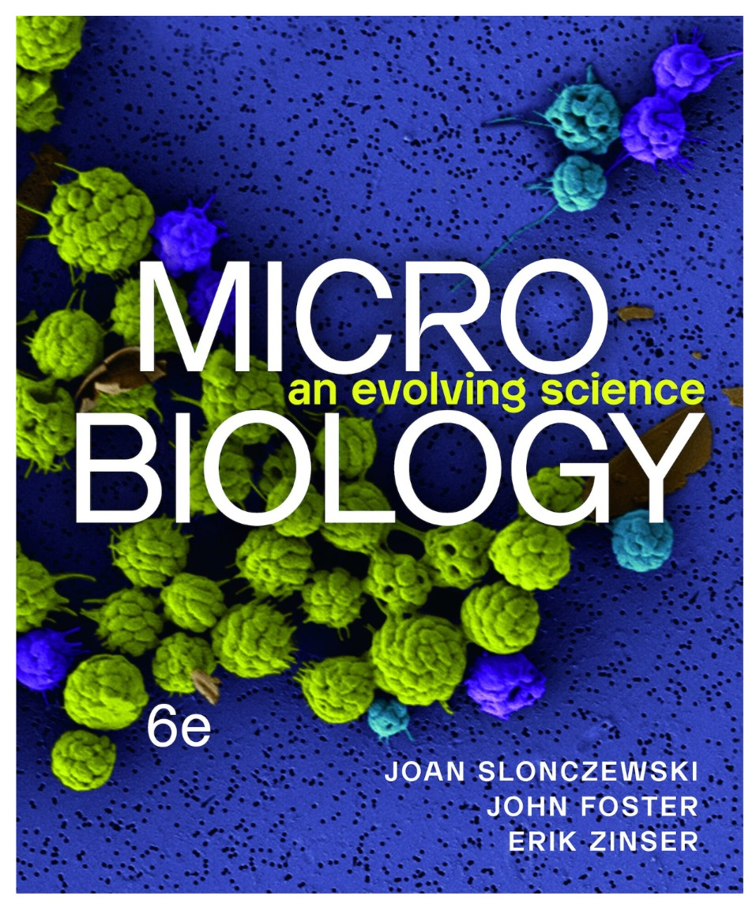{fig-alt="Cover of the sixth edition of Microbiology: An Evolving Science by Joan Slonczewski, John W. Foster, and Erik R. Zinser." width="75%"}
:::

::: {.column width="4%"}
:::

::: {.column width="74%"}
The history of microscopy, Robert Hooke, Antonie van Leeuwenhoek, and Louis Pasteur:

**Slonczewski, J., Foster, J. W., & Zinser, E. R. (2024).**\
*Microbiology: An Evolving Science* (6th ed.). W. W. Norton & Company.

[Explore *Microbiology: An Evolving Science* →](https://wwnorton.com/books/9781324033523)
:::
::::::

------------------------------------------------------------------------

# Case Study: Hong Kong, 1894

It is **1894**.

A major outbreak of plague has reached **Hong Kong**.

People are becoming severely ill and dying.

Scientists now have tools their medieval predecessors did not:

- germ theory
- improved microscopes
- staining techniques
- experimental methods

:::: {.columns}
::: {.column width="48%"}

You are part of a scientific team sent to investigate the outbreak.

Your task is not simply to describe what is happening.

::: {.callout-note title="Your Investigation"}
**Your task is to identify the cause.**

What evidence would you collect?

Where would you look?

What would you examine?
:::

:::

::: {.column width="4%"}
:::

::: {.column width="48%"}

{.lightbox fig-alt="Historical black-and-white photograph of the men's ward at the Kennedy Town Glassworks emergency plague hospital in Hong Kong during the 1894 plague epidemic, with patients lying on bedding along both sides of a long hospital ward." width="100%"}

**Source:** Echenberg, M. (2007). "An Unexampled Calamity: Hong Kong, 1894." In *Plague Ports: The Global Urban Impact of Bubonic Plague, 1894–1901* (pp. 16–46). NYU Press. [Access through JSTOR →](http://www.jstor.org.offcampus.lib.washington.edu/stable/j.ctt9qgb84.7)

:::
::::

------------------------------------------------------------------------

## Use What You Already Know

Remember the **One Health systems model** from our public health history?

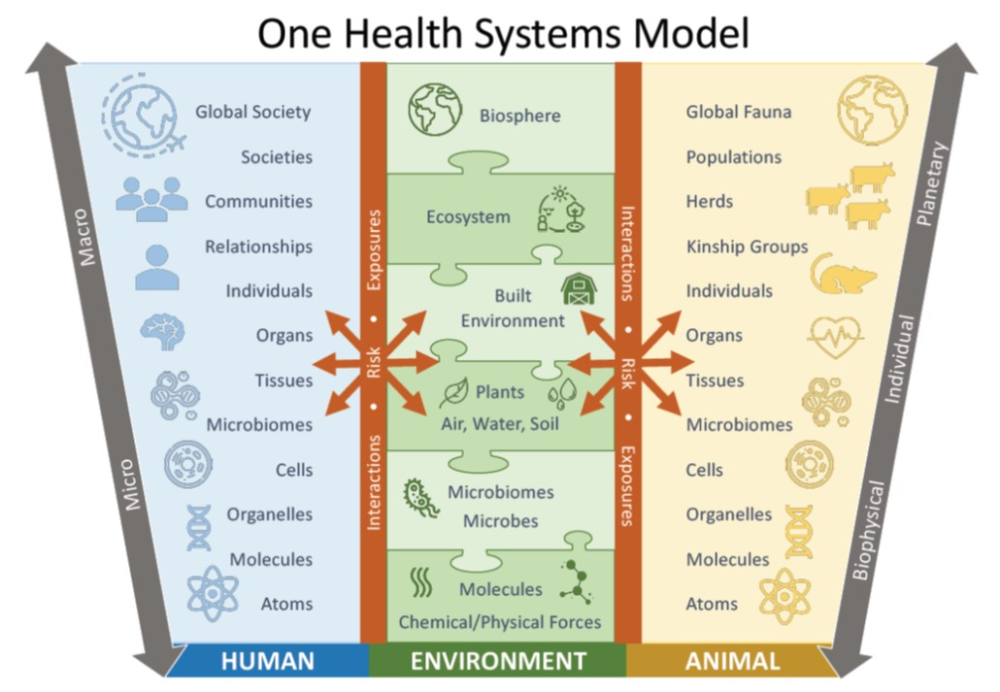{.lightbox fig-alt="One Health systems model showing connections among humans, animals, and the environment." width="80%"}

::: {.callout-note title="Investigate the System"}
Working with the people around you, consider the outbreak through three parts of the system:

**Humans**

- Who is becoming sick?
- What symptoms are occurring?
- What do affected people have in common?

**Animals**

- What animals are present?
- Are any animals becoming sick or dying?
- How might people interact with them?

**Environment**

- Where are cases occurring?
- What conditions might allow the disease to move?
- What work or daily activities could create opportunities for exposure?
:::

## Poll Everywhere

:::: {.columns .poll-columns}
::: {.column width="65%"}

### Where would you investigate first?

If you were investigating this outbreak in **1894**, where would you collect evidence first, and why?

Think about the **human, animal, and environmental** parts of the system.

:::

::: {.column width="5%"}
:::

::: {.column width="30%"}

::: {style="display:flex; justify-content:center; align-items:center; height:100%;"}
{fig-alt="Poll Everywhere QR code and response link for SHM 102" width="250"}
:::

:::
::::

------------------------------------------------------------------------

# Meet Alexandre Yersin

:::: {.columns}
::: {.column width="60%"}

**Alexandre Yersin**, a bacteriologist associated with the Pasteur Institute, traveled to Hong Kong to investigate the epidemic.

Yersin had essentially been given the problem you just worked through.

His task was to identify the organism responsible for plague.

### But first he needed a specimen.

:::

::: {.column width="4%"}
:::

::: {.column width="36%"}

::: {style="text-align:center;"}
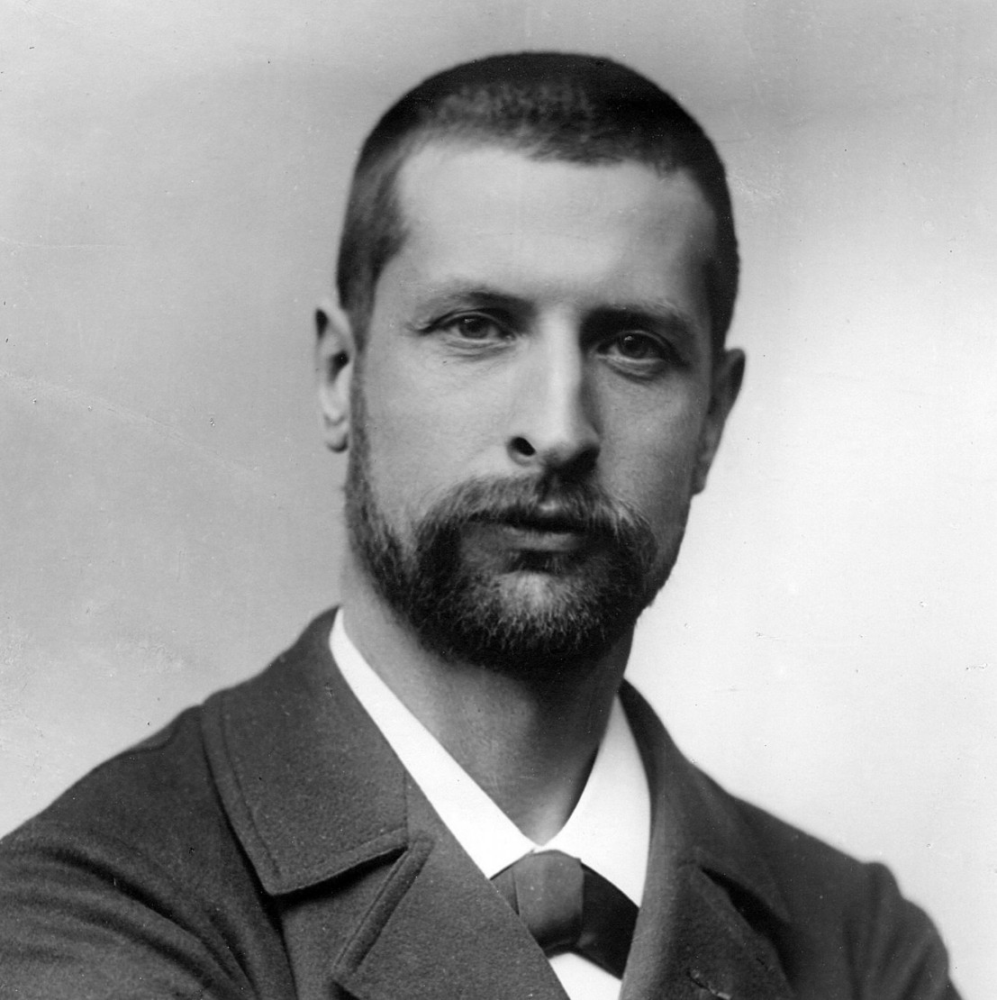{fig-alt="Black-and-white portrait of Alexandre Yersin, shown with short hair and a beard, wearing a dark suit and tie." width="85%"}
:::

:::
::::

------------------------------------------------------------------------

## The Bubo Becomes Evidence

:::: {.columns}
::: {.column width="55%"}

Yersin obtained access to the body of a person who had recently died from plague.

Using a sterile needle, he collected fluid from a **bubo**.

Think about the progression.

A swelling that physicians had observed for centuries was no longer only a symptom.

::: {.callout-tip title="From Symptom to Specimen"}
**The bubo became a source of biological evidence.**
:::

:::

::: {.column width="5%"}
:::

::: {.column width="40%"}

 *The Journal of Lancaster General Hospital*.](bubonic-plague-buboes.jpg){fig-alt="Clinical photograph showing a pronounced swollen lymph node in the neck associated with bubonic plague." width="100%"}

:::
::::

------------------------------------------------------------------------

## Following the Evidence

:::: {.columns}
::: {.column width="55%"}

Yersin examined the bubo fluid under a microscope.

He found it filled with bacteria.

Now there was a candidate organism.

But seeing bacteria in a sick person did not automatically prove that the bacteria caused plague.

Yersin used material from the bubo to inoculate guinea pigs.

The guinea pigs died.

When he examined them, he found the same bacteria.

The bacterium responsible for plague would eventually be named:

### *Yersinia pestis*

in recognition of Alexandre Yersin.

:::

::: {.column width="5%"}
:::

::: {.column width="40%"}

::: {style="text-align:center;"}
](yersinia-pestis-gram-stain.jpg){.lightbox fig-alt="Microscopic image showing Yersinia pestis bacteria stained pink and purple against a pale background." width="100%"}
:::

:::
::::

------------------------------------------------------------------------

## A One Health Clue

:::: {.columns}
::: {.column width="55%"}

Yersin noticed something else.

There were large numbers of dead rats in the streets, hospital corridors, and around the morgue.

He examined some of the rats.

### He found the same bacteria.

::: {.callout-note title="Return to the One Health Model"}
You now have evidence connecting the same organism with:

**Humans**

and

**Rats**

What does this new evidence add to your One Health systems model?

What relationship would you investigate next?
:::

:::

::: {.column width="5%"}
:::

::: {.column width="40%"}

::: {style="text-align:center;"}
](city-rats.jpg){fig-alt="Three rats climbing on and around a public trash can at night in New York City, with one rat carrying discarded food." width="100%"}
:::

:::
::::

------------------------------------------------------------------------


## Poll Everywhere

:::: {.columns .poll-columns}
::: {.column width="65%"}

### What would you investigate next?

You have found the **same bacterium in humans and rats**.

What would you investigate next to determine **how the bacterium reaches humans**?

Think about:

- human activities 
- animal contact
- the environment
- possible intermediaries
- patterns that could distinguish one explanation from another

:::

::: {.column width="5%"}
:::

::: {.column width="30%"}

::: {style="display:flex; justify-content:center; align-items:center; height:100%;"}
{fig-alt="Poll Everywhere QR code and response link for SHM 102" width="250"}
:::

:::
::::

------------------------------------------------------------------------

# Back to 1894

### What Had Yersin Solved?

Yersin had answered an enormous question.

### What causes plague?

**A bacterium: *Yersinia pestis*.**

::: {.callout-note title="One Question Remained"}
But another question remained unanswered.

**How was the bacterium moving between rats and humans?**

Knowing the **hazard** did not automatically reveal the **exposure pathway**.
:::


We know the agent.

We know humans and rats can be infected.

But we still do not know the exposure pathway.

::: {.callout-note title="The Next Investigation"}
If rats and humans can carry the same organism, how would you determine **how the organism moves from rats to humans?**

Yersin had connected plague with rats.

Another investigator would take the next major step.
:::


------------------------------------------------------------------------

# Paul Louis Simond

:::: {.columns}
::: {.column width="60%"}

French army physician **Paul Louis Simond** traveled to Vietnam and India to follow up on Yersin's observations.

He noticed an important occupational health pattern.

Twenty laborers in a wool factory had been cleaning dead rats from the floor.

**Those 20 workers died of plague.**

Other factory workers who had **no contact with the rats** did not become ill.

That observation suggested an exposure relationship.

### Look at the Task

The workers shared a workplace.

But they did not share the same **task** or **opportunity for exposure**.

**What was different about the work performed by the workers who became ill?**

:::

::: {.column width="4%"}
:::

::: {.column width="36%"}

::: {style="text-align:center;"}
.](paul-louis-simond.jpg){fig-alt="Historical black-and-white photograph of Paul Louis Simond wearing a laboratory coat and working with scientific equipment at a laboratory bench." width="100%"}
:::

:::
::::
------------------------------------------------------------------------

## Poll Everywhere

:::: {.columns .poll-columns}
::: {.column width="65%"}

### What additional information would you want?

The important question is **not** simply:

**What was their job title?**

Think like an exposure scientist.

What would you want to know about the workers' **tasks, animal contact, and work environment** before deciding how exposure might be occurring?

:::

::: {.column width="5%"}
:::

::: {.column width="30%"}

::: {style="display:flex; justify-content:center; align-items:center; height:100%;"}
{fig-alt="Poll Everywhere QR code and response link for SHM 102" width="250"}
:::

:::
::::

Some workers were cleaning floors containing dead rats.

Their work created an opportunity for exposure.


------------------------------------------------------------------------

## Another Observation

Simond noticed something about the rats.

Healthy rats groomed themselves and tended to have relatively few fleas.

Sick rats could no longer groom effectively.

They carried many fleas.

Then the rats died.

### What happened to the fleas?

------------------------------------------------------------------------

## A Hypothesis

Simond proposed that an intermediary might connect infected rats with humans.

Perhaps the rat itself was not directly transmitting the disease.

Perhaps the intermediary was a:

### flea

------------------------------------------------------------------------

# Testing the Hypothesis

:::: {.columns}
::: {.column width="55%"}

Simond designed an experiment.

He placed a **plague-infected rat at the bottom of a jar**.

Above it, he suspended a **healthy rat in a wire mesh cage**.

The wire mesh prevented the rats from directly touching.

But fleas could move from the sick rat to the healthy rat.

### The healthy rat developed plague.

:::

::: {.column width="5%"}
:::

::: {.column width="40%"}

::: {style="text-align:center;"}
](bbc-plague-rat-experiment.jpg){.lightbox fig-alt="BBC reconstruction showing a healthy rat suspended in a wire mesh cage above a plague-infected rat at the bottom of a large glass container." width="100%"}
:::

:::
::::

------------------------------------------------------------------------

## The Control

Simond also tested what happened when fleas were absent.

Without fleas, healthy rats exposed to the experimental conditions did not develop plague.

When fleas were introduced:

### plague appeared.

The transmission pathway was becoming clear.

------------------------------------------------------------------------

# The Transmission Pathway

## Rodent → Flea → Human

:::: {.columns}
::: {.column width="40%"}

Plague can move between rodents and humans through **fleas**.

A flea feeds on a rodent infected with *Yersinia pestis* and acquires the bacterium.

When an infected rodent becomes sick or dies, fleas may leave the animal and seek another blood meal.

If an infected flea bites a human, *Yersinia pestis* can enter the new host.

### Rodent → Flea → Human

This was the transmission pathway Simond had been investigating.

:::

::: {.column width="4%"}
:::

::: {.column width="56%"}

::: {style="text-align:center;"}
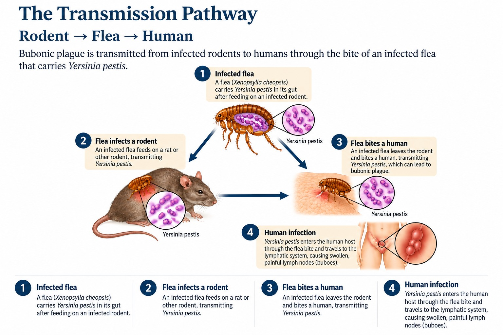{.lightbox fig-alt="Diagram showing bubonic plague transmission involving Yersinia pestis, an infected flea, a rodent, a flea bite to a human, and subsequent human infection." width="100%"}
:::

:::
::::

------------------------------------------------------------------------

# Agent, Reservoir, Vector, Susceptible Host

We can now give names to the major parts of an infectious disease transmission system.

## Agent

A microorganism (bacterium, virus, fungus, or other infectious material) that causes disease.

## Reservoir

An organism that maintains a virus or bacterial pathogen in an area by serving as a host.

## Vector

An organism (e.g., insect) that can carry infectious agents from one animal to another.

## Susceptible Host

A person or animal that can become infected by an infectious agent due to lack of immunity.

------------------------------------------------------------------------

# Understanding the Disease

Now that we know the agent, we can better understand what happens after infection.

*Yersinia pestis* can produce different forms of disease depending on **how the bacteria enter the body and where the infection develops**.

:::: {.columns}
::: {.column width="40%"}

### Bubonic Plague

Bacteria reach the **lymphatic system** and multiply in regional lymph nodes, producing swollen lymph nodes called **buboes**.

### Septicemic Plague

Bacteria enter the **bloodstream**, producing a severe systemic infection.

### Pneumonic Plague

Bacteria infect the **lungs**.

Respiratory droplets from a person or animal with pneumonic plague can transmit *Yersinia pestis* to another person.

### Same Agent, Different Forms of Disease

The agent remains the same:

***Yersinia pestis***

What changes is the **route of exposure and where infection develops in the body**.

:::

::: {.column width="4%"}
:::

::: {.column width="56%"}

::: {style="text-align:center;"}
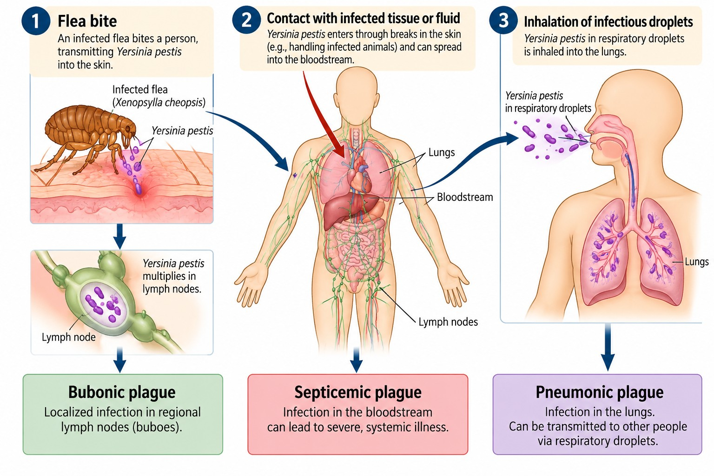{.lightbox fig-alt="Diagram showing three routes of exposure to Yersinia pestis: an infected flea bite leading to bubonic plague, contact with infected tissue or fluid leading to septicemic plague, and inhalation of infectious droplets leading to pneumonic plague." width="100%"}
:::

:::
::::

------------------------------------------------------------------------


# From Microbiology to Occupational Health

Now consider plague as an occupational health problem.

### Who might encounter this exposure pathway because of their work?

Possible occupational groups include:

- ranchers
- livestock workers
- veterinarians
- veterinary technicians
- animal control workers
- wildlife biologists
- agricultural workers
- pest control workers

The occupational hazard is not determined by the job title alone.

It depends on the **task and opportunity for exposure**.

------------------------------------------------------------------------

## Think Like an Exposure Scientist

For any biological hazard, ask:

- What is the agent?
- Where is the reservoir?
- How does it leave the reservoir?
- How does it move through the environment?
- How does it reach the worker?
- What route allows it to enter the body


------------------------------------------------------------------------

# Plague in the United States

:::: {.columns}
::: {.column width="40%"}

Plague still occurs naturally in parts of the **western United States**.

*Yersinia pestis* circulates among wild rodents and their fleas.

Humans and domestic animals can be exposed when infected fleas seek another host.

This means plague remains relevant to:

- wildlife work
- veterinary work
- outdoor work
- animal handling
- public health surveillance

Although human plague is uncommon, recognizing the **agent, reservoir, vector, and susceptible host** helps us understand where exposure can occur and how it can be prevented.

:::

::: {.column width="4%"}
:::

::: {.column width="56%"}

::: {style="text-align:center;"}
](cdc-plague-ecology-usa.jpg){.lightbox fig-alt="CDC diagram showing plague circulating naturally among wild rodents and fleas in the western United States and how infected fleas can expose humans and domestic animals." width="100%"}
:::

:::
::::

------------------------------------------------------------------------

# From Hong Kong to Central Washington

The investigation that began in Hong Kong helped reveal how *Yersinia pestis* moves through an environment and reaches humans.

More than a century later, plague remains present in the United States.

:::: {.columns}
::: {.column width="40%"}

Human cases have occurred primarily in the **western United States**.

The geographic pattern reminds us that infectious disease transmission depends on more than the presence of an agent.

It also depends on:

- animal reservoirs
- vectors
- environmental conditions
- opportunities for human exposure

### What biological hazards follow similar pathways in Central Washington?

:::

::: {.column width="4%"}
:::

::: {.column width="56%"}

::: {style="text-align:center;"}
](1970-2020-cdc-plague.jpg){.lightbox fig-alt="Map of the contiguous United States showing reported human plague cases from 1970 through 2020 as red dots, with cases concentrated primarily in western states." width="100%"}
:::

:::
::::

------------------------------------------------------------------------

# Key Takeaway

The disease existed before we understood it.

The exposure pathway existed before we understood it.

The hazard did not suddenly appear when scientists identified it.

### Our ability to observe, measure, and explain it changed.

Plague provides a historical example of how **observation, technology, experimentation, microbiology, and exposure science** can help us understand a biological hazard.

In occupational health, identifying the hazard is only the beginning.

We also need to understand:

- where it comes from
- how it moves
- who encounters it
- how exposure occurs
- what happens after exposure
- where we can intervene

------------------------------------------------------------------------

# Key Terms

| Term | Definition |
|---|---|
| **Germ theory** | The scientific concept that microorganisms can cause disease. |
| **Pathogen** | A biological agent capable of causing disease. |
| **Agent** | A microorganism or other infectious material that causes disease. |
| **Reservoir** | An organism that maintains a virus or bacterial pathogen in an area by serving as a host. |
| **Vector** | An organism that can carry infectious agents from one animal to another. |
| **Susceptible host** | A person or animal that can become infected by an infectious agent due to lack of immunity. |
| **Transmission route** | The way an infectious agent moves from its source or reservoir to a susceptible host. |
| **Vector-borne transmission** | Transmission of an infectious agent through a living vector. |
| ***Yersinia pestis*** | The bacterium that causes plague. |

------------------------------------------------------------------------

## Make your flashcards

### Copy → Paste → Study

Copy the terms below to make your own **Anki or Quizlet** flashcards.

**Anki:** Save as a `.txt` file → Import → Select **Semicolon** as the field separator.

``` text
Germ theory;The scientific concept that microorganisms can cause disease.
Pathogen;A biological agent capable of causing disease.
Agent;A microorganism or other infectious material that causes disease.
Reservoir;An organism that maintains a virus or bacterial pathogen in an area by serving as a host.
Vector;An organism that can carry infectious agents from one animal to another.
Susceptible host;A person or animal that can become infected by an infectious agent due to lack of immunity.
Transmission route;The way an infectious agent moves from its source or reservoir to a susceptible host.
Vector-borne transmission;Transmission of an infectious agent through a living vector.
Yersinia pestis;The bacterium that causes plague.
```

### Copyright & Use

**SHM 102: Occupational Health**\
© 2026 Yoni Rodriguez

Except where otherwise noted, original course materials are licensed under the Creative Commons Attribution-NonCommercial 4.0 International License (CC BY-NC 4.0).

Third-party materials remain subject to their respective copyright and licensing terms.
